# NederLearn

### Introduction

*"Embrace Adventure, Connect the World: NederLearn—Where Dutch Learning Becomes a Journey"*

NederLearn is an exciting companion in your journey to learn the Dutch language and understand its culture. Instead of the usual mundane and tedious language learning, NederLearn offers a thrilling exploration through films, books, articles, and podcasts about Dutch culture. It's more than just a language app — it's a community of Dutch language enthusiasts ready for a linguistic adventure. Whether you're an expat preparing for the Dutch Integration Exam or simply want to engage in light-hearted banter with Dutch colleagues, NederLearn is the perfect companion. Get ready to add a dash of excitement to your Dutch learning journey. Your adventure begins here.

**Developer: Johann Blignaut** <br>
[Live webpage](https://nederlearn-v5-c628536a9899.herokuapp.com/accounts/login/)<br>
[Project Repository](https://github.com/Blignaut24/NederLearn_V5.git)<br>

## Table of Content

- [NederLearn](#nederlearn)
    - [Introduction](#introduction)
  - [Table of Content](#table-of-content)
  - [Project Overview](#project-overview)
    - [User Goals](#user-goals)
      - [**Products and Services**](#products-and-services)
      - [**Gain Creators**](#gain-creators)
      - [**Pain Relievers**](#pain-relievers)
      - [**Customer Jobs**](#customer-jobs)
      - [**Gains**](#gains)
    - [**Pains**](#pains)
    - [Site Owner Goals](#site-owner-goals)
  - [User Experience (UX) Design](#user-experience-ux-design)
    - [Target Audience](#target-audience)
    - [User Requirements and Expectations](#user-requirements-and-expectations)
    - [MoSCoW Method](#moscow-method)
    - [Epics and User Stories](#epics-and-user-stories)
    - [Sitemap](#sitemap)
    - [Wireframe](#wireframe)
  - [User Interface (UI) Design](#user-interface-ui-design)
    - [Color Palette](#color-palette)
      - [Main Colors](#main-colors)
      - [Text and Background Colors](#text-and-background-colors)
      - [Background Options:](#background-options)
      - [Special Message Colors](#special-message-colors)
      - [Benefits](#benefits)
  - [Font Selection](#font-selection)
    - [Font Implementation](#font-implementation)
    - [Technical Integration](#technical-integration)
  - [Technologies Used](#technologies-used)
    - [Languages](#languages)
    - [**Frameworks**](#frameworks)
    - [**Database**](#database)
  - [**Media Management Platform**](#media-management-platform)
  - [**Tools:**](#tools)
  - [**Supporting Libraries and Packages**](#supporting-libraries-and-packages)
  - [Database Structure](#database-structure)
    - [EDR Symbols](#edr-symbols)
  - [Methodology](#methodology)
    - [Agile Project Management with GitHub Project](#agile-project-management-with-github-project)
    - [User Stories as GitHub Issues](#user-stories-as-github-issues)
    - [Bug Tracking System](#bug-tracking-system)
    - [Iterative Development Approach](#iterative-development-approach)
    - [Future Development Roadmap](#future-development-roadmap)
  - [Testing](#testing)
  - [Bug Reports](#bug-reports)
    - [Known Bugs ❌](#known-bugs-)
    - [Fixed bugs ✅](#fixed-bugs-)
- [Deployment](#deployment)
  - [App Deployment](#app-deployment)
    - [1. Create a New App](#1-create-a-new-app)
    - [2. Configure Settings](#2-configure-settings)
    - [3. Config Vars Setup](#3-config-vars-setup)
    - [4. Add PostgreSQL Database](#4-add-postgresql-database)
    - [5. Configure DATABASE\_URL](#5-configure-database_url)
    - [6. Environment Variable Setup](#6-environment-variable-setup)
    - [7. Heroku Config Vars](#7-heroku-config-vars)
    - [8. Django Settings](#8-django-settings)
    - [9. Migrate Models](#9-migrate-models)
    - [10. Cloudinary Integration](#10-cloudinary-integration)
      - [10.1 Cloudinary Account](#101-cloudinary-account)
      - [10.2 Copy CLOUDINARY\_URL](#102-copy-cloudinary_url)
      - [10.3 Environment Variable Setup](#103-environment-variable-setup)
      - [10.4 Heroku Config Vars](#104-heroku-config-vars)
      - [10.5 Django Settings](#105-django-settings)
    - [11. Templates Setup](#11-templates-setup)
    - [12. Additional Setup](#12-additional-setup)
    - [13. Procfile Setup](#13-procfile-setup)
    - [14. Deployment Steps](#14-deployment-steps)
  - [Version Control (Using GitPod)](#version-control-using-gitpod)
    - [1. Add Changes](#1-add-changes)
    - [2. Commit Changes](#2-commit-changes)
    - [3. Push to GitHub](#3-push-to-github)
  - [Repository Management](#repository-management)
    - [1. Forking the Repository](#1-forking-the-repository)
    - [2. Cloning the Repository](#2-cloning-the-repository)
  - [Credits](#credits)
    - [Learning Resources](#learning-resources)
    - [Code and Technical Support](#code-and-technical-support)
    - [Media Resources](#media-resources)
    - [Testing and Feedback](#testing-and-feedback)
    - [Tutorials](#tutorials)
  - [Acknowledgments](#acknowledgments)

## Project Overview

NederLearn is a digital platform created specifically for English speakers who are interested in learning Dutch. The platform provides an assortment of media resources, including movies and podcasts, to help improve Dutch language proficiency. These resources span numerous topics and cater to different levels of Dutch language competence. The primary goals of NederLearn are to provide engaging language learning materials and foster a supportive community that promotes interaction among learners of the Dutch language.

### User Goals

We've chosen the Value Proposition Canvas (VPC) to visually demonstrate how our app's features align with our users' desires and necessities. The VPC consists of two parts: The Customer Profile, which examines the customer's identity and preferences, and The Value Map, which illustrates how a product can enhance the customer's experience.


> **The Value Proposition Canvas** — Bland, David J.; Osterwalder, Alexander. Testing Business Ideas: A Field Guide for Rapid Experimentation (Strategyzer) (p. 22). Wiley. Kindle Edition.

<details>
<summary>Value Map</summary>
A Value Map illustrates the specific benefits of our app by highlighting its key features:

#### **Products and Services**

Here is a list of the services that the NederLearn app provides to its users:

- The platform is browser-based.
- The application's interface is designed to be simple and easy to navigate.
- The selected resource material is carefully curated.
- It offers a summary and an external link to the content.
- Users can choose from a variety of media formats: books, movies, music, podcasts, and series.
- Resources can be organized according to the **Common European Framework of Reference (CEFR)**:
  - A. Beginner Level
    - A1. Beginner
    - A2. Elementary
  - B. Intermediate Level
    - B1. Intermediate
    - B2. Upper Intermediate
  - C. Advanced Level
    - C1. Advanced
    - C2. Expert

#### **Gain Creators**

Here are the advantages users can enjoy when utilizing the NederLearn app:

- The app can be accessed on most devices with an internet connection.
- The NederLearn interface is designed to be user-friendly and easy to navigate, ensuring a positive user experience.
- The superuser diligently reviews all materials, and user comments serve as valuable feedback, further enhancing the quality of the recommendations. This process ensures users can access top-notch Dutch language resources without wasting time searching.
- Users can delve into a digital multimedia experience, with links to Dutch books, movies, music, podcasts, and series.
- Using the European language levels provides a clear structure that helps users identify their current proficiency in the language and outlines the steps needed to advance to the next level.

#### **Pain Relievers**

How the NederLearn App Addresses Users' Challenges

- The NederLearn app is accessible from any device with internet access, allowing users to learn at their own pace and convenience.
- The app features a user-friendly interface, reducing navigational difficulties and enhancing the learning process.
- Careful curation of resource material saves users time and effort in searching for quality content.
- Each content piece is accompanied by a summary and an external link, providing a quick overview and easy access.
- The app offers diverse media formats, catering to different learning preferences.
- Resources are organized according to the European Framework for Language Levels, providing users a clear learning path and addressing the common challenge of progression in language learning.
</details>

<details>
<summary>User Profiles</summary>
This provides a detailed and organized overview of a potential user segment interested in the NederLearn app.

#### **Customer Jobs**

Describe the tasks that users can do in their professional and personal lives with the NederLearn app.

- Access learning materials from any device with internet access
- Navigate a user-friendly interface
- Avoid wasting time searching for quality content
- Get a quick overview and easy access to each content piece
- Learn through diverse media formats
- Follow a clear learning path based on the European Framework for Language Framework Levels

#### **Gains**

Describe the goals users hope to achieve or the specific benefits they are seeking with the NederLearn app.

- Easy use of the app on different devices
- Simple navigation with a user-friendly interface
- Access to carefully checked, high-quality Dutch resources
- Fun with Dutch books, movies, music, podcasts, and series
- Clear learning path using European language levels

### **Pains**

Explain the possible negative outcomes, risks, and problems that could arise from using the NederLearn app.

- Some devices or browsers might not work well with the platform.
- The design might be hard to use for some people.
- There might not be enough different types of resources.
- The summaries might miss some key details.
- Users might not find their favorite media formats, like games or videos.
- The European Language Framework Levels might not match some users' real skill levels.
- There might not be enough content for advanced users to continue improving.
</details>

### Site Owner Goals

- Ensure that the Dutch resources suggested on the NederLearn app are of excellent quality and relevant for all users, regardless of their Dutch language level.
- Uphold an exceptional user experience by ensuring smooth navigation and a design that responds well on all devices.
- Ensure that the website provides a secure and friendly environment for all users to share their opinions about the recommended resources.

<p align="right">(<a href="#table-of-content">back to top</a>)</p>

---

## User Experience (UX) Design

### Target Audience

- The target audience is English speakers interested in learning Dutch.
- This encompasses expatriates in the Netherlands, students learning Dutch, tourists planning a trip to the Netherlands, individuals preparing for the "Inburgering" exam, and anyone interested in Dutch culture and language.
- The app is suitable for various proficiency levels, from beginners to advanced learners.

### User Requirements and Expectations

- The NederLearn app features an aesthetically pleasing and intuitive interface, which promotes easy navigation and content discovery.
- A secure registration and login process, ensuring user data protection and privacy.
- Interactive features such as the ability to like, comment, and create posts that facilitate community engagement.
- Access to a wide variety of Dutch language resources and the ability for users to contribute their own insights and reviews.

### MoSCoW Method

The NederLearn application uses the MoSCoW method for brainstorming and prioritizing different features. This list is flexible and the final features of the NederLearn app may differ. The MoSCoW method categorizes tasks into four distinct groups for better organization and prioritization.

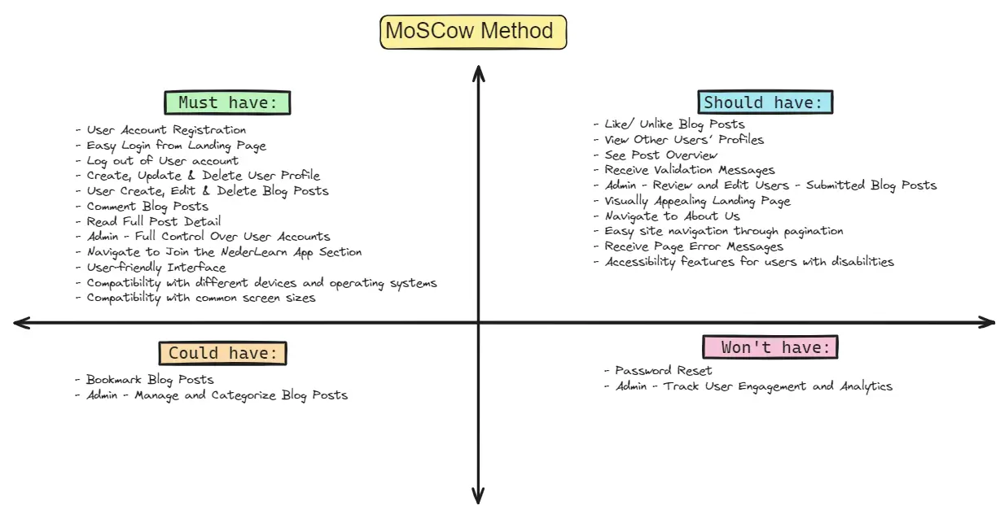

### Epics and User Stories

The NederLearn app employs the MoSCoW method to categorize its functionalities into Epics, with each Epic containing associated user stories. These tasks are segmented into four distinct "epics," each corresponding to a specific sprint or milestone. Click this link for a detailed overview of the project milestones.

<details>
<summary>Epic 1: User Authentication and Profile Management</summary>
This epic covers user account management, including registration, authentication, and profile modifications.

- User Account Registration [(Must Have)](https://github.com/users/Blignaut24/projects/19/views/2?filterQuery=Account+Registration&pane=issue&itemId=92779487&issue=Blignaut24%7CNederLearn_V5%7C5)
- Easy Login from Landing Page [(Must Have)](https://github.com/users/Blignaut24/projects/19/views/2?filterQuery=Easy+Login&pane=issue&itemId=92779261&issue=Blignaut24%7CNederLearn_V5%7C4)
- Log Out of User Account [(Must Have)](https://github.com/users/Blignaut24/projects/19/views/2?filterQuery=Log+out&pane=issue&itemId=92779117&issue=Blignaut24%7CNederLearn_V5%7C3)
- Create, Update & Delete User Profile [(Must Have)](https://github.com/Blignaut24/NederLearn_V5/issues/37)
- Password Reset [(Won't Have)](https://github.com/users/Blignaut24/projects/19/views/2?filterQuery=Password+Reset&pane=issue&itemId=92778858&issue=Blignaut24%7CNederLearn_V5%7C1)

</details>
<details>
<summary>Epic 2: Blog Interaction & Content Management</summary>
This Epic focuses on main blog features like creating, reading, editing, and deleting posts, as well as engaging with posts through comments and likes.

- User Create, Edit & Delete Blog Posts [(Must Have)](https://github.com/users/Blignaut24/projects/19/views/2?filterQuery=Blog+Posts&pane=issue&itemId=92789167&issue=Blignaut24%7CNederLearn_V5%7C13)
- Comment Blog Posts [(Must Have)](https://github.com/users/Blignaut24/projects/19/views/2?filterQuery=Comment&pane=issue&itemId=92789030&issue=Blignaut24%7CNederLearn_V5%7C12)
- Like/ Unlike Blog Posts [(Should Have)](https://github.com/users/Blignaut24/projects/19/views/2?filterQuery=Unlike&pane=issue&itemId=92788879&issue=Blignaut24%7CNederLearn_V5%7C11)
- View Other Users' Profiles [(Should Have)](https://github.com/users/Blignaut24/projects/19/views/2?filterQuery=View+Other&pane=issue&itemId=92780276&issue=Blignaut24%7CNederLearn_V5%7C10)
- See Post Overview [(Should Have)](https://github.com/users/Blignaut24/projects/19/views/2?filterQuery=Post+Overview&pane=issue&itemId=92780166&issue=Blignaut24%7CNederLearn_V5%7C9)
- Read Full Post Detail [(Must Have)](https://github.com/users/Blignaut24/projects/19/views/2?filterQuery=Post+Detail&pane=issue&itemId=92780042&issue=Blignaut24%7CNederLearn_V5%7C8)
- Bookmark Blog Posts [(Could Have)](https://github.com/users/Blignaut24/projects/19/views/2?filterQuery=Bookmark&pane=issue&itemId=92779888&issue=Blignaut24%7CNederLearn_V5%7C7)
- Receive Validating Messages [(Should Have)](https://github.com/users/Blignaut24/projects/19/views/2?filterQuery=Validating+&pane=issue&itemId=92779724&issue=Blignaut24%7CNederLearn_V5%7C6)

</details>
<details>
<summary>Epic 3: Administration and Analytics</summary>
This section covers site management such as overseeing user accounts, regulating content, and monitoring user activity.

- Admin - Full Control Over User Accounts [(Must Have)](https://github.com/users/Blignaut24/projects/19/views/2?filterQuery=Full+Control&pane=issue&itemId=92789774&issue=Blignaut24%7CNederLearn_V5%7C17)
- Admin - Review and Edit User-Submitted Blog Posts [(Must Have)](https://github.com/users/Blignaut24/projects/19/views/2?filterQuery=Review+and+Edit&pane=issue&itemId=92789659&issue=Blignaut24%7CNederLearn_V5%7C16)
- Admin - Manage and Categorize Blog Posts [(Could Have)](https://github.com/users/Blignaut24/projects/19/views/2?filterQuery=Categorize&pane=issue&itemId=92789524&issue=Blignaut24%7CNederLearn_V5%7C15)
- Admin - Track User Engagement and Analytics [(Won't Have)](https://github.com/users/Blignaut24/projects/19/views/2?filterQuery=Analytics&pane=issue&itemId=92789386&issue=Blignaut24%7CNederLearn_V5%7C14)

</details>
<details>
<summary>Epic 4: User Experience & Accessibility</summary>
This epic concentrates on improving the site's overall user experience, including the look of the homepage, ease of navigation, and information accessibility.

- Visually Appealing Landing Page [(Should Have)](https://github.com/users/Blignaut24/projects/19/views/2?filterQuery=Landing+Page&pane=issue&itemId=92790689&issue=Blignaut24%7CNederLearn_V5%7C24)
- Navigate to About Us [(Should Have)](https://github.com/users/Blignaut24/projects/19/views/2?filterQuery=About+Us&pane=issue&itemId=92790517&issue=Blignaut24%7CNederLearn_V5%7C23)
- Compatibility with different devices and operating systems [(Must Have)](https://github.com/Blignaut24/NederLearn_V5/issues/38)
- Navigate to Join the Club Section [(Must Have)](https://github.com/users/Blignaut24/projects/19/views/2?filterQuery=Club+Section&pane=issue&itemId=92790294&issue=Blignaut24%7CNederLearn_V5%7C21)
- Navigate through a well-designed website [(Must Have)](https://github.com/users/Blignaut24/projects/19/views/2?filterQuery=Navigate&pane=issue&itemId=92790143&issue=Blignaut24%7CNederLearn_V5%7C20)
- Site pagination for easy navigation [(Should Have)](https://github.com/users/Blignaut24/projects/19/views/2?filterQuery=pagination&pane=issue&itemId=92790050&issue=Blignaut24%7CNederLearn_V5%7C19)
- Receive Page Error Messages [(Won't Have)](https://github.com/Blignaut24/NederLearn_V5/issues/39)

</details>

### Sitemap

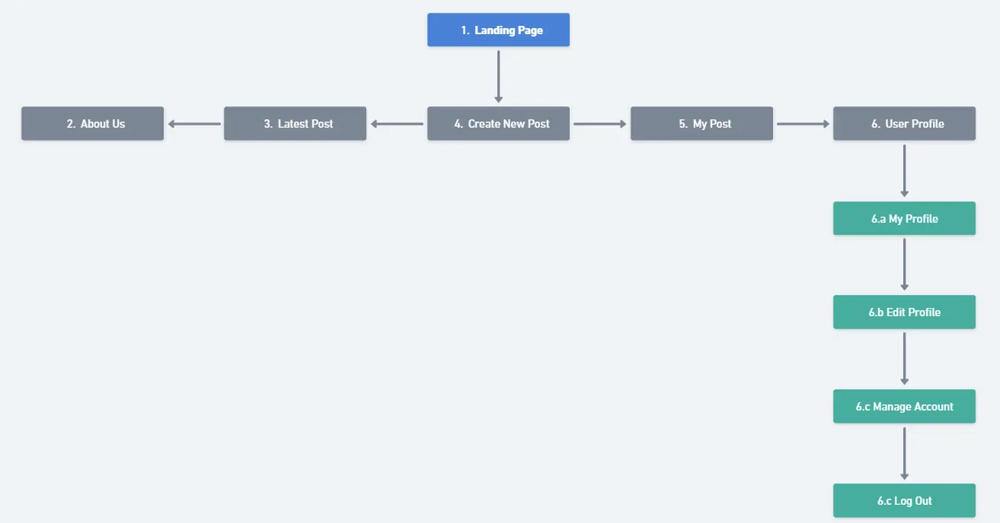

### Wireframe
The wireframes showcase the mobile-first approach used in planning and developing this application. This design methodology ensures optimal user experience across all devices, starting with mobile layouts and scaling up. Click on each page to view the detailed wireframe designs.

<details><summary>Landing page</summary>

</details>
<details><summary>About Us</summary>

</details>
<details><summary>Register Account</summary>

</details>
<details><summary>Post Overview</summary>

</details>
<details><summary>Full Post Detail</summary>

</details>
<details><summary>Create New Post</summary>

</details>
<details><summary>Edit / Update Post</summary>
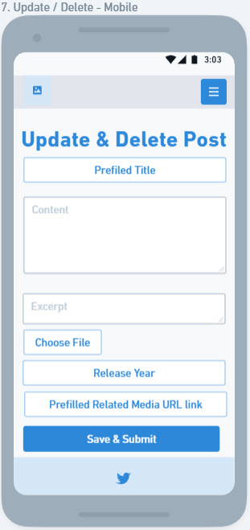
</details>
<details><summary>My Posts / Bookmarked</summary>

</details>
<details><summary>Manage Account</summary>

</details>
<details><summary>My Profile</summary>
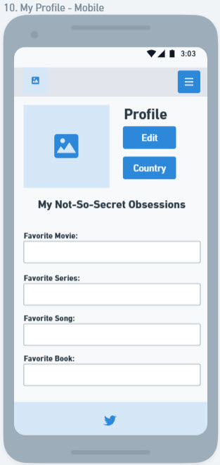
</details>
<details><summary>User Profile</summary>
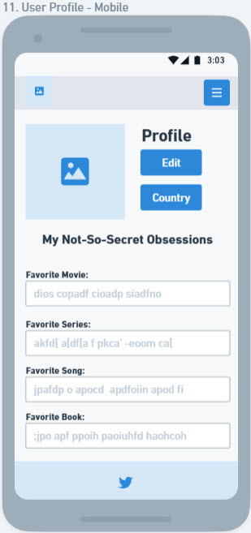
</details>
<details><summary>Home Page - Post Overview</summary>

</details>
<p align="right">(<a href="#table-of-content">back to top</a>)</p>

---

## User Interface (UI) Design

### Color Palette

The NederLearn color palette reflects careful psychological design choices. Deep blue (#001a73) creates trust and professionalism in the learning environment, while warm orange (#ff7b29) energizes interactive elements to encourage user engagement. Rose pink (#c85c86) provides a softer, approachable accent that balances the authoritative blue. The messaging system uses green (#00614a) to indicate success, red (#dd1c1a) for alerts, and orange (#f79818) for warnings. Both light and dark modes maintain strong contrast for accessibility without compromising the psychological impact of each color.

#### Main Colors


- **Midnight Blue** (`#001a73`): Main color - professional and reminds people of learning and trust
- **Pumpkin** (`#ff7b29`): Buttons and clickable elements - contrasts well with blue
- **Magenta** (`#c85c86`): Friendly accent color for small details

#### Text and Background Colors
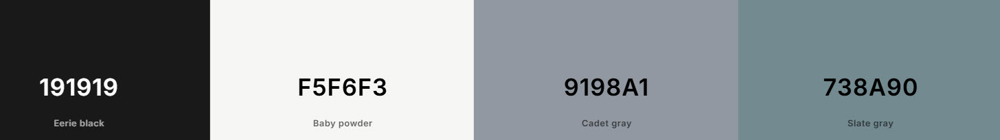

- **Dark Text** (`#191919`): Primary text color
- **Light Text** (`#f5f6f3`): Text on dark backgrounds
- **Gray Variations** (`#9198a1`, `#738a90`): Secondary text

#### Background Options:
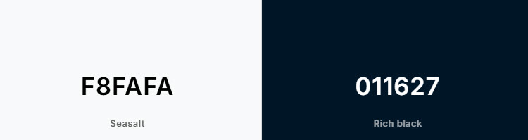
  - Light Mode (`#f8fafa`): Soft white
  - Dark Mode (`#011627`): Deep blue-black

#### Special Message Colors

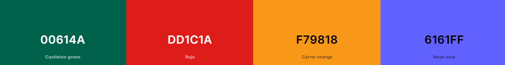

- **Green** (`#00614a`): Success messages
- **Red** (`#dd1c1a`): Error messages
- **Orange** (`#f79818`): Warning messages
- **Purple** (`#6161ff`): Hover state for interactive elements

#### Benefits

- Easy to read and use
- Professional but friendly
- Works in light and dark modes
- Clear visual hierarchy for interactive elements

<p align="right">(<a href="#table-of-content">back to top</a>)</p>

## Font Selection

For NederLearn, I carefully selected fonts that enhance readability and learning experience:

- Montserrat as primary font - its clean lines and modern feel make learning content easily digestible
- Open Sans for body text - known for excellent readability across devices, perfect for educational content
- Playfair Display for emphasis - adds a professional, academic touch to important concepts

Backup fonts were chosen for optimal performance:

- Raleway - maintains the modern, educational feel if Montserrat fails to load
- Roboto - ensures consistent readability as a fallback option

### Font Implementation

These fonts are strategically used throughout the app:

- Main headings (H1): Montserrat/Raleway for clear content hierarchy
- Subheadings (H2): Open Sans/Roboto for smooth content scanning
- Special text: Playfair Display for highlighting key learning points

### Technical Integration

All fonts are loaded via Google Fonts CDN, ensuring fast loading times and cross-browser compatibility - essential for a smooth learning experience.

<p align="right">(<a href="#table-of-content">back to top</a>)</p>

## Technologies Used

### Languages

- **HTML (HyperText Markup Language)**: Used to structure the content and layout of web pages. HTML provides the foundation for organizing text, images, and other elements in NederLearn, ensuring proper document structure and accessibility.
- **CSS (Cascading Style Sheets)**: Handles the visual styling and presentation of the website. CSS is essential for creating an attractive and responsive design that works across different devices and screen sizes.
- **Python**: The primary backend programming language used in NederLearn. Python's simplicity and extensive libraries make it perfect for handling server-side logic, data processing, and user authentication.
- **JavaScript**: Adds interactivity and dynamic features to the website. JavaScript enhances user experience by enabling real-time updates, form validation, and smooth animations without page reloads.


### **Frameworks**

- **Django:** A high-level Python web framework that promotes rapid development and pragmatic, clean design. It adheres to the "don't repeat yourself" (DRY) principle and is built on the model-view-template architectural pattern. It was used to build the NederLearn web app.
- **Crispy Form:** A Django application that helps you manage and format your Django form output. It allows you to control form rendering in your templates while keeping boilerplate to a minimum. It supports different form styles and integrates seamlessly with Bootstrap 4 and up.
- **Boostrap v5.0:** Bootstrap is a free tool that helps you build websites that look good on both desktop and mobile. It has templates for different parts of a website, which can save developers time and effort.

### **Database**

- **ElephantSQL:** A service that takes care of all the complex tasks related to managing a PostgreSQL database.

## **Media Management Platform**

- **Cloudinary:** This is a cloud-based platform that facilitates the storage, management, and delivery of media for the NederLearn app. It specifically handles image management for the project.

## **Tools:**

- **Font Awesome**: A collection of free, customizable vector icons you can use on a website.
- [**Formatter.org**](http://Formatter.org): A free online tool for automatically formatting and beautifying Python code according to PEP 8 style guidelines.
- **Git**: A version control system for tracking changes in source code during software development.
- **GitHub**: A web-based platform that provides hosting for software development and version control using Git.
- **Gitpod**: An online IDE platform that lets you create software directly from your web browser.
- **Google Fonts**: A library of free, open-source fonts used to enhance typography on the website.
- **Heroku**: A cloud application platform used for deploying and hosting the NederLearn app.
- **Notion AI**: An artificial intelligence tool designed to assist with note-taking, data management, and organization within the Notion platform. It aids in planning and writing the NederLearn app README document.
- **Visual Studio Code (VS Code)**: A free code editor from Microsoft that supports multiple programming languages, offers built-in debugging tools, and can be enhanced with extensions.
- **Whimsical**: A collaborative visual workspace used for brainstorming, designing, and coordinating team efforts. It has been utilized to design visual diagrams, create flowcharts, wireframes, and sticky notes for the NederLearn app, enhancing the app's conceptualization and planning process.

## **Supporting Libraries and Packages**

- `asgiref==3.7.2`: This package allows your Python web application to handle multiple requests at the same time.
- `cloudinary==1.37.0`: This helps your application to manage images and videos in the cloud.
- `dj-database-url==0.5.0`: This simplifies the process of connecting your Django application to a database.
- `dj3-cloudinary-storage==0.0.6`: This is used to store and manage your Django application's files in the cloud using Cloudinary.
- `Django==4.2.1`: Django is a high-level Python web framework that helps you build web applications quickly.
- `gunicorn==21.2.0`: This is a server that runs your web application.
- `psycopg2==2.9.9`: This package allows your Django application to interact with a PostgreSQL database.
- `pytz==2023.3.post1`: This helps you handle different time zones in your Python applications.
- `sqlparse==0.4.4`: This is a library that helps you parse SQL queries.
- `urllib3==1.26.15`: This package allows your application to send HTTP requests.

<p align="right">(<a href="#table-of-content">back to top</a>)</p>


## Database Structure

During the planning phase of the NederLearn project, I utilized [**Whimsical**](https://whimsical.com) to create an **Entity Relationship Diagram (ERD)** for visualizing the database structure schema.

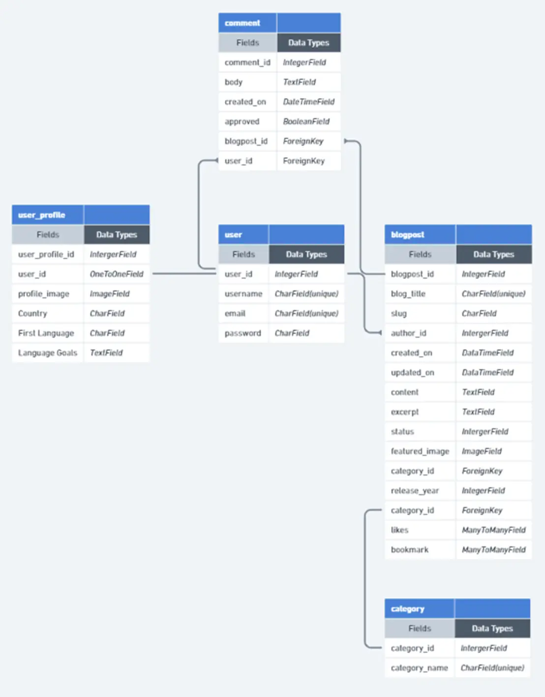

### EDR Symbols

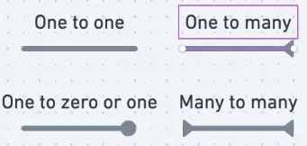

<p align="right">(<a href="#table-of-content">back to top</a>)</p>

---
## Methodology
### Agile Project Management with GitHub Project

I implemented GitHub's project management tools to efficiently track development progress. The project board, organized with "To Do," "In Progress," and "Done" columns, provided clear visualization of task progression.

### User Stories as GitHub Issues

To ensure user-centric development, I created GitHub issues as user stories. Example: "As a Dutch learner, I want to practice vocabulary, so I can improve my language skills." This approach guided feature development to meet actual user needs.

### Bug Tracking System

GitHub Issues served as a robust bug tracking system. Each issue documented specific problems, their details, and resolution status, ensuring systematic problem-solving.

### Iterative Development Approach

The project followed an iterative development cycle, implementing and testing features incrementally. This methodology allowed for thorough testing and continuous improvement based on feedback.

### Future Development Roadmap

A comprehensive feature roadmap tracks planned enhancements, including interactive exercises and mobile app development. This structured approach ensures organized and prioritized future development.

<p align="right">(<a href="#table-of-content">back to top</a>)</p>

---

## Testing

The NederLearn project underwent thorough testing to ensure it works well and provides a good experience for users. Our testing process covered several important areas:

- Code validation - Making sure our HTML, CSS, and Python code meets quality standards
- Accessibility testing - Checking that the website can be used by everyone
- Performance testing - Testing how well the website runs
- Device testing - Making sure it works on different devices
- Browser compatibility - Testing across different web browsers
- User testing - Getting feedback from users and improving their experience

Each section below details what we tested and what we found. All results are documented in this [**TESTING.md**](TESTING.md) file .


<p align="right">(<a href="#table-of-content">back to top</a>)</p>

---

## Bug Reports
I've added links to the bug reports from my GitHub project in my README.md. Each issue number is clickable and will take you to the full details of the bug and how it was fixed.

### Known Bugs ❌ 
**Known bugs** are issues in the code that still need to be fixed. These include problems that have been identified but require further investigation, resources, or future updates to resolve.

I've connected bug descriptions to the issues in my documentation to make them easier to find. You can click on the issue numbers to see more detailed bug reports.

| Bug Description | Bug Report Link |Bug Type |
| --- | --- |--- |
| 🐞Hidden Accessibility Errors in Blog Forms| [#43](https://github.com/Blignaut24/NederLearn_V5/issues/42) |♿️ Accessibility Bug |


### Fixed bugs ✅
**Fixed bugs** are issues that have been successfully resolved. Documenting fixed bugs helps track progress and provides solutions for similar issues that may arise in the future.

| Bug Description | Bug Report Link |Bug Type |
| --- | --- |--- |
| 🐞 Bug Report: PostgreSQL Database Connection Error on Heroku| [#40](https://github.com/Blignaut24/NederLearn_V5/issues/40) |🔌 Connection Bug ⚙️ Configuration Bug |
| 🐞 Bug Report: Cloudinary URL Configuration Error in Django Heroku Deployment| [#41](https://github.com/Blignaut24/NederLearn_V5/issues/41) |🔌 Connection Bug ⚙️ Configuration Bug |
| 🐞 Bug Report: CSS Changes Not Reflecting in Browser Despite Hard Refresh - style.css File Updates Not Taking Effect.| [#42](https://github.com/Blignaut24/NederLearn_V5/issues/42) |🎨 Display Bugs  |

<p align="right">(<a href="#table-of-content">back to top</a>)</p>

---

# Deployment

## App Deployment
Purpose: Guide for setting up and deploying a Django application on Heroku with all necessary configurations.

### 1. Create a New App
Purpose: Initialize your application on Heroku's platform
1. Create a new app on Heroku dashboard.

<details><summary>Screenshot</summary>
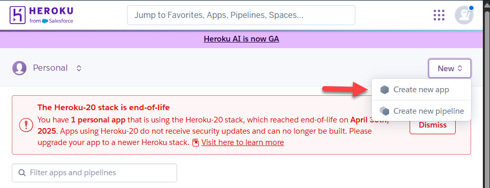
</details>

*For additional information about creating an app using Heroku, refer to their [documentation](https://devcenter.heroku.com/articles/getting-started-with-python).* 

### 2. Configure Settings
Purpose: Set up basic application configurations.
1. Navigate to "Settings" in new app.
<details><summary>Screenshot</summary>
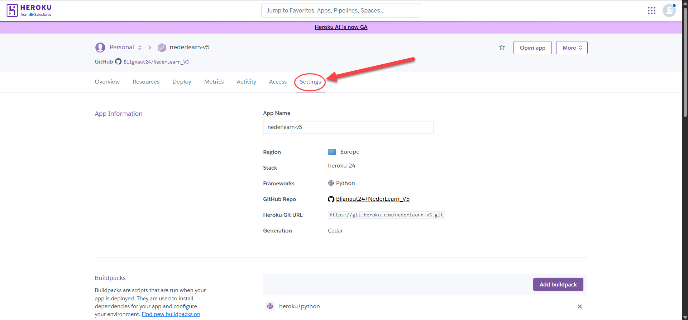
</details>


### 3. Config Vars Setup
Purpose: Configure essential environment variables
1. In "Config Vars," add `PORT` as the key and `8000` as its value
<details><summary>Screenshot</summary>
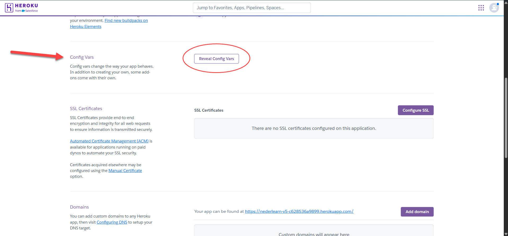
</details>

*For more information, click the [link](https://devcenter.heroku.com/articles/config-vars).* 

### 4. Add PostgreSQL Database
Purpose: Set up the production database
1. Choose PostgreSQL as database
2. Example "ElephantSQL" was used in this project

### 5. Configure DATABASE_URL
Purpose: Connect your application to the database
1. In "Config Vars," add `DATABASE_URL` and copy the URL from the PostgreSQL dashboard
2. Note: If using ElephantSQL as the PostgreSQL provider, you can use the URL provided by ElephantSQL

### 6. Environment Variable Setup
Purpose: Secure sensitive information and configure local development
1. Create a new file in the workspace called `env.py`
2. Import the `os` library and set the environment variable for `DATABASE_URL` to the Heroku address
3. Add a secret key using `os.environ["SECRET_KEY"] = "your secret key here"`

### 7. Heroku Config Vars
Purpose: Secure production environment variables
1. Add the secret key to the Heroku app's config vars in the settings

### 8. Django Settings
Purpose: Configure Django application settings for production
1. In `settings.py` of Django app, import `Path` from `pathlib`, `os`, and `dj_database_url`
2. Add `if os.path.isfile("env.py"): import env` to the file
3. Replace the SECRET_KEY with `SECRET_KEY = os.environ.get('SECRET_KEY')`
4. Replace the database section with `DATABASES = {'default': dj_database_url.parse(os.environ.get("DATABASE_URL"))}`

### 9. Migrate Models
Purpose: Initialize database structure
1. In workspace terminal, migrate the models to the new database connection

### 10. Cloudinary Integration
Purpose: Set up media file handling

#### 10.1 Cloudinary Account
Purpose: Create access to cloud storage
1. Log in to [Cloudinary account](https://cloudinary.com/integrations) or create one

#### 10.2 Copy CLOUDINARY_URL
Purpose: Obtain connection credentials

[Documentation](https://cloudinary.com/documentation/): Link to CLOUDINARY and ask for help with finding the CLOUDINARY_URL if needed 
1. Copy `CLOUDINARY_URL`.

#### 10.3 Environment Variable Setup
Purpose: Configure local Cloudinary access
1. In `env.py`, add `os.environ["CLOUDINARY_URL"] = "add cloudinary_url here"`.

#### 10.4 Heroku Config Vars
Purpose: Configure production Cloudinary access
1. In Heroku settings, add `CLOUDINARY_URL` to config vars

#### 10.5 Django Settings
Purpose: Set up Django to use Cloudinary
1. In `INSTALLED_APPS`, add `cloudinary_storage`, `Django.contrib.staticfiles`, and `cloudinary` in this order.
2. Configure static file settings in `settings.py`.

### 11. Templates Setup
Purpose: Configure template rendering
1. Link the file to the templates directory in Heroku with `TEMPLATES_DIR = os.path.join(BASE_DIR, 'templates')`
2. Change the templates directory to `TEMPLATES_DIR - 'DIRS': [TEMPLATES_DIR]`

### 12. Additional Setup
Purpose: Create necessary project directories
1. Create three new folders: `media`, `static`, and `templates`

### 13. Procfile Setup
Purpose: Tell Heroku how to run the application
1. Create a `Procfile`
2. Add the following line inside the Procfile: `web: gunicorn project_name_here.wsgi`

### 14. Deployment Steps
Purpose: Launch the application
1. Push all changes to GitHub
2. In the Heroku deployment tab, deploy manually for the first time
3. Monitor the process
4. Once successful, set up automatic deployments

## Version Control (Using GitPod)
Purpose: Manage code changes and updates

### 1. Add Changes
Purpose: Stage modified files
1. In the GitPod terminal, use the command `git add .` to stage changes

### 2. Commit Changes
Purpose: Save staged changes with description
1. Commit changes with a descriptive comment:
```
git commit -m "Push comment here"
```

### 3. Push to GitHub
Purpose: Upload changes to remote repository
1. Push the updates to the repository:
```
git push
```

## Repository Management
Purpose: Guide for managing project copies and local development

### 1. Forking the Repository
Purpose: Create a personal copy of the project
1. Log into GitHub account or create one
2. Navigate to the repository URL
3. Click "Fork" at the top right of the repository page

*For additional information about forking the repository, please refer to the source documentation [link](https://docs.github.com/en/pull-requests/collaborating-with-pull-requests/working-with-forks/fork-a-repo).*

### 2. Cloning the Repository
Purpose: Create a local working copy
1. Go to the GitHub repository
2. Click the green "Code" button
3. Select your preferred cloning method (HTTPS, SSH, or GitHub CLI)
4. Copy the URL
5. Open your terminal
6. Navigate to desired directory
7. Run: `git clone https://github.com/Blignaut24/NederLearn_V5.git`
8. Press Enter to create your local clone

*For additional information about cloning the repository, please refer to the source documentation [link](https://docs.github.com/en/repositories/creating-and-managing-repositories/cloning-a-repository).*

<p align="right">(<a href="#table-of-content">back to top</a>)</p>

---


## Credits

I would like to express my gratitude to the following people and resources that have contributed to this project:

### Learning Resources

- W3Schools - For their comprehensive web development tutorials
- Khan Academy - For their excellent math and science educational content
- [Code.org](http://Code.org) - For their beginner-friendly programming lessons
- DebbieBergstrom: For the structure of the README and TEST.md files

### Code and Technical Support

- Stack Overflow community - For helping solve various coding challenges
- GitHub Documentation - For guidance on version control
- Visual Studio Code - For providing an excellent code editor with helpful extensions

### Media Resources

- Unsplash - For providing free, high-quality images
- Canva - For graphic design elements and templates
- Font Awesome - For the icons used throughout the project

### Testing and Feedback

- My fellow students - For their valuable feedback and testing
- My teachers - For their guidance and support throughout the project
- My family - For their patience and encouragement

### Tutorials   
- **[Zero To Mastery (ZTM)](https://zerotomastery.io/courses/django-bootcamp/)**: For their comprehensive Django tutorials.
- **[Code Institute (CI)](https://codeinstitute.net/nl/)**: Code Institute's Django tutorials provided valuable guidance for development.

</details>

<p align="right">(<a href="#table-of-content">back to top</a>)</p>

---

## Acknowledgments

I extend my deepest gratitude to everyone who supported me during this project's development. My mentor's invaluable guidance, feedback, and constant encouragement were essential. The Code Institute tutors and student support team provided crucial technical expertise and timely assistance, helping me overcome numerous coding challenges. I'm thankful to the Code Institute Slack community for creating a collaborative space where discussions and code reviews thrived. I'm especially grateful to my family for their steadfast support throughout my coding journey, and to the beta testers who provided vital feedback on the application. Most importantly, Soli Deo Gloria. 

<p align="right">(<a href="#table-of-content">back to top</a>)</p>

---
