# NederLearn Testing Report

This document outlines the comprehensive testing process for the NederLearn Blog application. Testing is crucial to ensure our application works reliably and provides a great experience for all users.

## Key Testing Areas

1. **Code Validation**
   - Ensuring HTML, CSS, and Python code meets quality standards
2. **Accessibility**
   - Making sure the website is usable by everyone
3. **Performance**
   - Testing how the website runs on both desktop and mobile devices
4. **Device Compatibility**
   - Verifying functionality across different devices
5. **Browser Compatibility**
   - Ensuring consistent performance across different web browsers
6. **Automated Testing**
   - Using systematic tests for views, models, and URLs
7. **Manual Testing**
   - Including security checks, user story verification, and user experience testing

The testing process helps us identify and fix potential issues before they affect users, ensuring a stable and reliable platform.

Return to [**README.md**](README.md)

## Content

1. [**Code Validation**](#code-validation)
   1. [HTML Validation](#html-validation)
   2. [CSS Validation](#css-validation)
   3. [Python Validation](#python-validation)
2. **Accessibility**
   1. Wave
3. **Performance**
   1. Desktop Performance
   2. Mobile Performance
4. Performance Test on Various Devices
5. **Browser Compatibility**
6. **Automated Testing**
   1. test_views.py
   2. test_models.py
   3. test_urls.py
7. **Manual Testing**
   1. Security Testing
   2. Testing User Stories
   3. User Experience and Improvements
   4. Full Testing
8. **Summary**

## Code Validation

This section explains how we checked the code quality of the NederLearn Blog app. We focused on checking three main parts: HTML, CSS, and Python code.

We used these tools to check the HTML code:

- [W3C Markup Validator](https://validator.w3.org/) - A tool that checks if HTML code follows web standards
- Chrome Developer Tools - Used to look at and copy HTML from our website pages
- Summernote - A tool that helps create formatted text
- Django's |safe filter - Makes sure HTML content displays safely on the website
- Django's MessageMiddleware - Turned off temporarily during testing to get accurate results

(<a href="#content">back to top</a>)
 

### HTML Validation

The [W3C Markup Validator](https://validator.w3.org/) was used to check our HTML code for compliance with web standards. Each page of the NederLearn app was validated to ensure proper markup structure and accessibility.

| **Nr** | **Tested**           | **Result** | **View Result**                                                                                        | **Pass** |
| ------ | -------------------- | ---------- | ------------------------------------------------------------------------------------------------------ | :------: |
| 1      | login.html           | No errors  | 

Screenshot of result
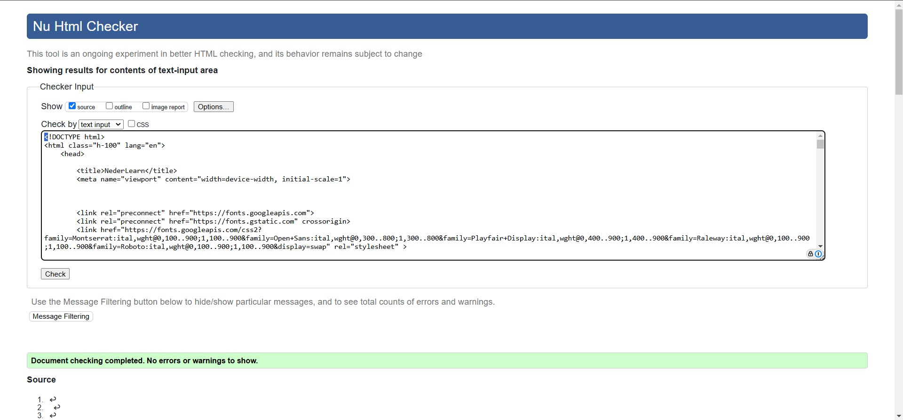
      |    ✅    |
| 2      | about_us.html        | No errors  | 

Screenshot of result
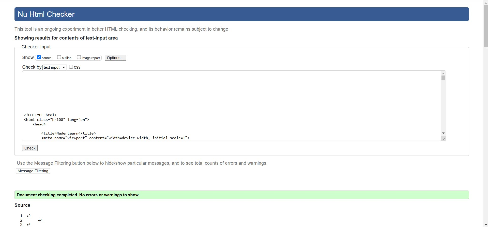
      |    ✅    |
| 3      | signup.html          | No errors  | 

Screenshot of result
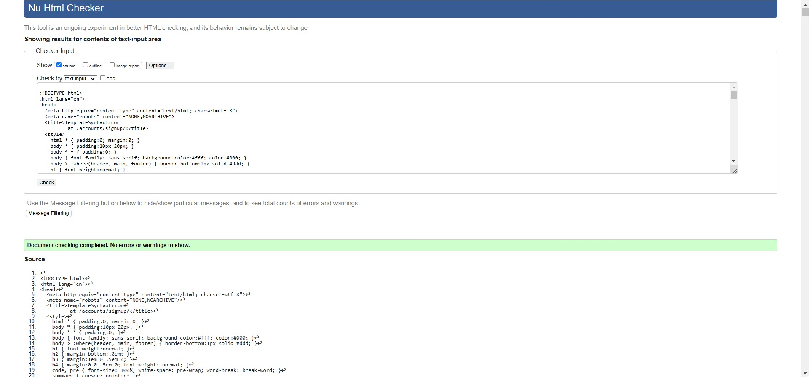
       |    ✅    |
| 4      | index.html           | No errors  | 

Screenshot of result

      |    ✅    |
| 5      | blogpost_detail.html | No errors  | 

Screenshot of result

                                  |    ✅    |
| 6      | blogpost_create.html | No errors  | 

Screenshot of result

                                  |    ✅    |
| 7      | blogpost_update.html | No errors  | 

Screenshot of result

                                  |    ✅    |
| 8      | blogpost_delete.html | No errors  | 

Screenshot of result

| 9      | profile.html         | No errors  | 

Screenshot of result
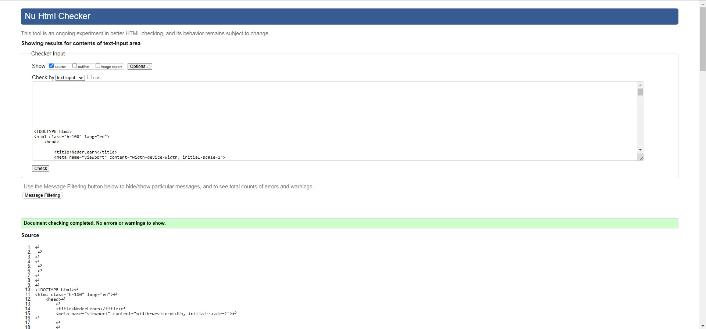
                                  |    ✅    |
| 10     | profile_edit.html    | No errors  | 

Screenshot of result

                                  |    ✅    |
| 11     | account_manage.html  | No errors  | 

Screenshot of result

                                  |    ✅    |
| 12     | my_posts.html        | No errors  | 

Screenshot of result

                                  |    ✅    |
| 13     | bookmarked.html      | No errors  | 

Screenshot of result

 |    ✅    |
| 14     | logout.html          | No errors  | 

Screenshot of result
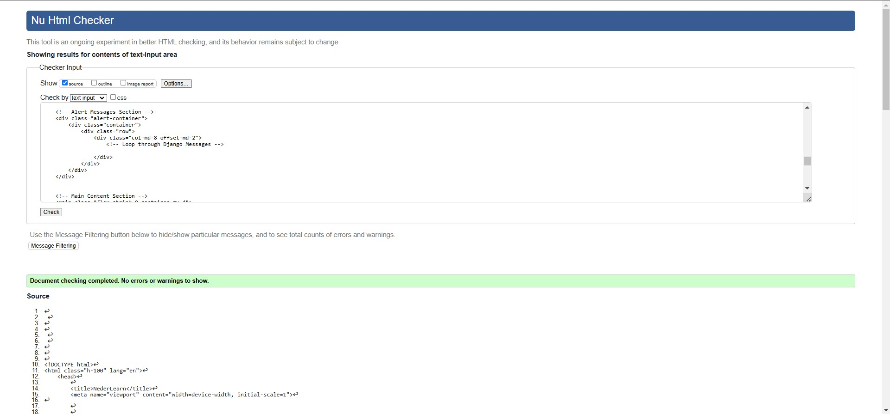
     |    ✅    |

(<a href="#content">back to top</a>)
 

### CSS

[**W3C Jigsaw**](https://jigsaw.w3.org/css-validator/)  is a tool that checks if your website's styling code (CSS) is correct.

| **Nr** | **Tested** | **Result** | **View Result**                                                                                 | **Pass** |
| ------ | ---------- | ---------- | ----------------------------------------------------------------------------------------------- | :------: |
| 1      | CSS File   | No errors  | 

Screenshot of result
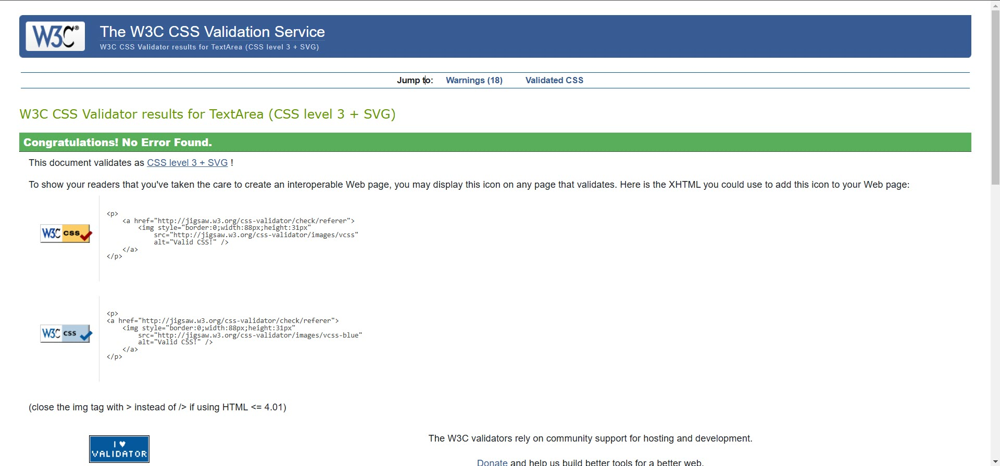
 |    ✅    |

(<a href="#content">back to top</a>)
 

### Python Validation

[**PEP 8**](https://pep8ci.herokuapp.com/) is a style guide for Python programming that provides guidelines for code formatting and naming conventions. It helps developers write more readable and maintainable code.

| **Nr** | **Tested**                | **Result**                 | **View Result**                                                       | **Pass** |
| ------ | ------------------------- | -------------------------- | --------------------------------------------------------------------- | :------: |
| 1      | nederlearn/settings.py    | All clear, no errors found | 

Screenshot of result
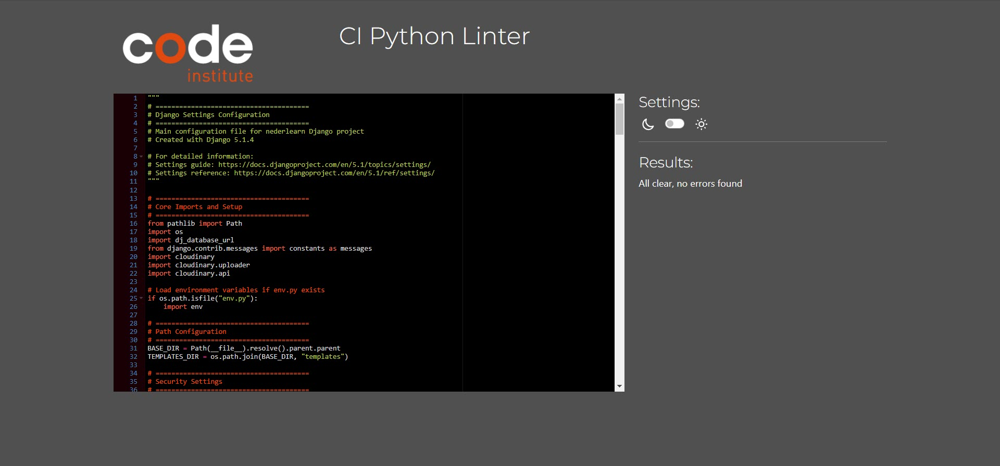
|✅
| 2      | nederlearn/urls.py        | All clear, no errors found | 

Screenshot of result
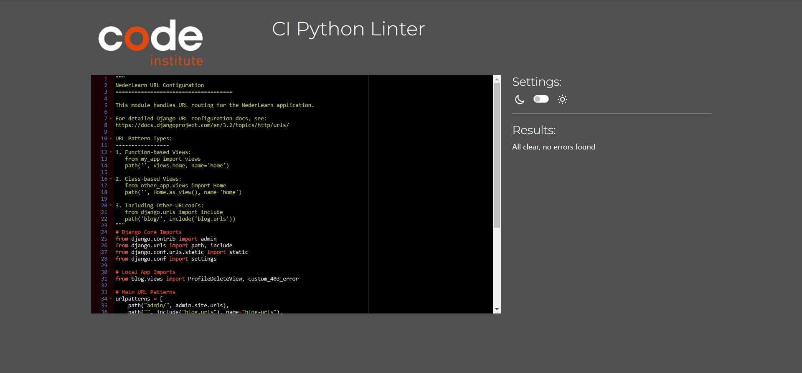
 |    ✅    |
| 3      | blog/models.py            | All clear, no errors found | 

Screenshot of result
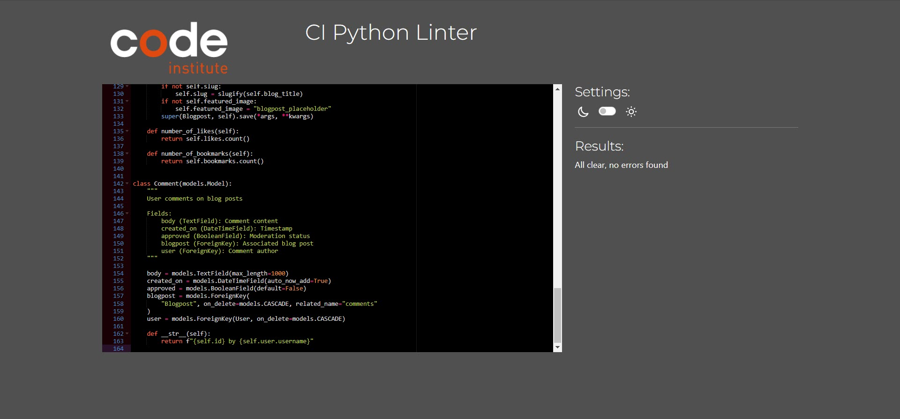
 |    ✅    |
| 3      | blog/views.py             | All clear, no errors found | 

Screenshot of result
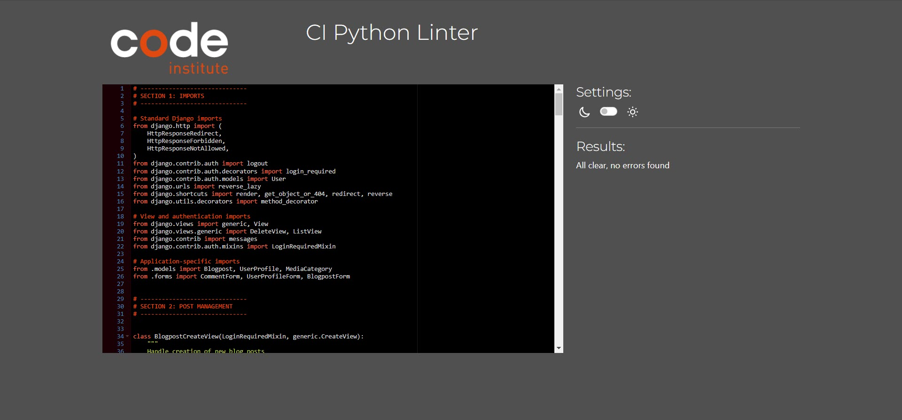
 |    ✅    |
| 4      | blog/forms.py             | All clear, no errors found | 

Screenshot of result
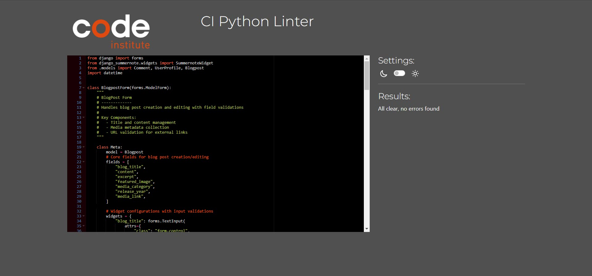
 |    ✅    |
| 5      | blog/urls.py              | All clear, no errors found | 

Screenshot of result
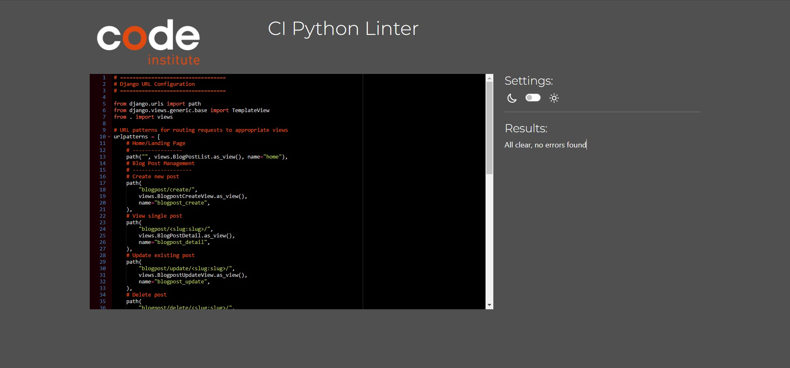
 |    ✅    |
| 6      | blog/admin.py             | All clear, no errors found | 

Screenshot of result
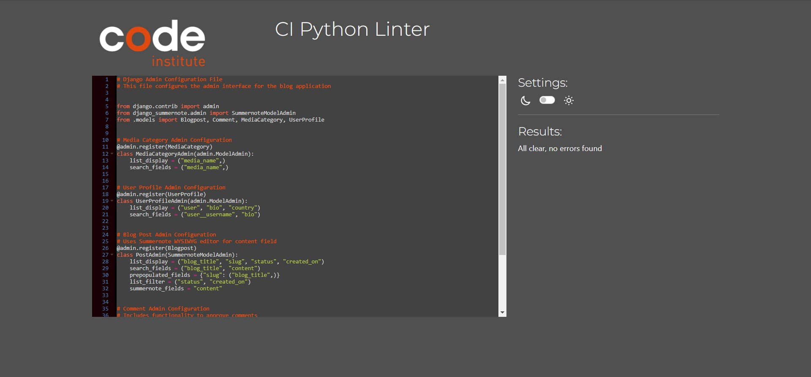
 |    ✅    |
| 7      | blog/tests/test_views.py  | All clear, no errors found | 

Screenshot of result
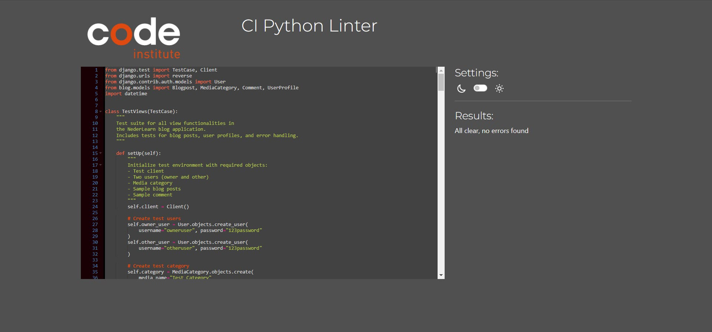
 |    ✅    |
| 8      | blog/tests/test_models.py | All clear, no errors found | 

Screenshot of result
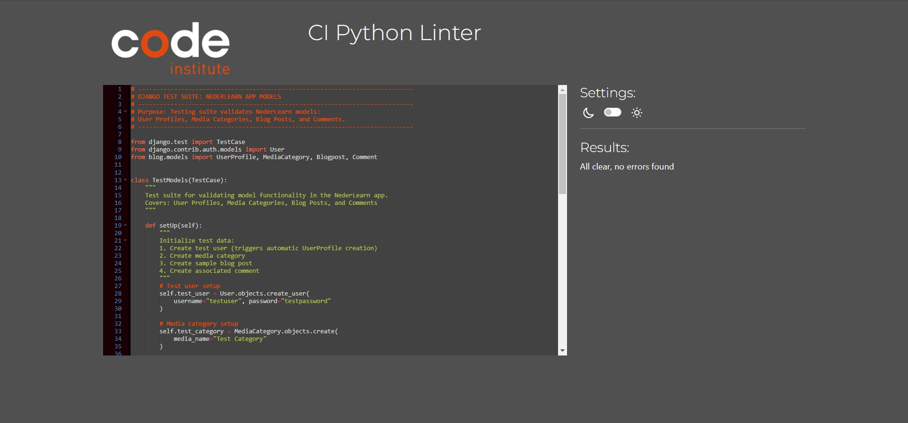
 |    ✅    |
| 9      | blog/tests/test_urls.py   | All clear, no errors found | 

Screenshot of result
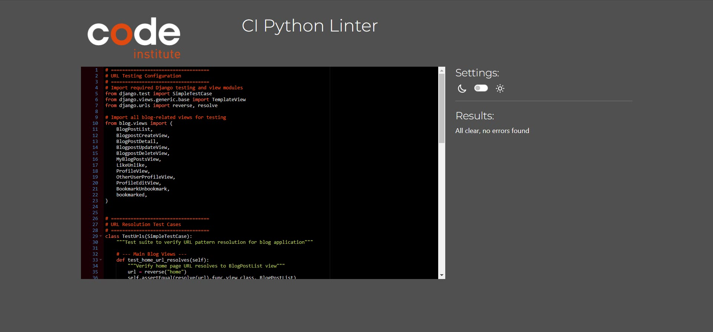
 |    ✅    |

(<a href="#content">back to top</a>)
 

# Accessibility

I have conducted accessibility testing to evaluate our website's usability for all users. Using **WAVE** [Web Accessibility Evaluation Tool](https://wave.webaim.org/) (Web Accessibility Evaluation Tool), we assessed compliance with accessibility standards and identified one key area requiring improvement:

(<a href="#content">back to top</a>)
 
