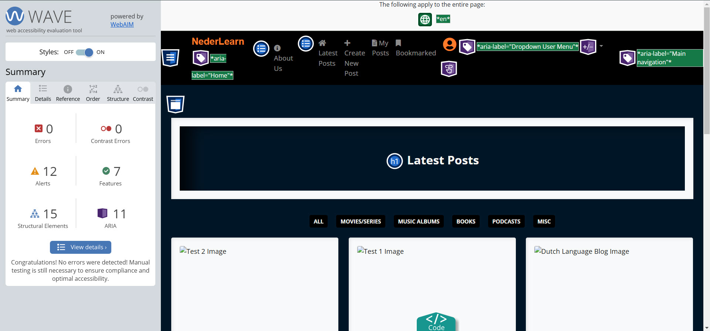

# NederLearn Testing Report

This document outlines the comprehensive testing process for the NederLearn Blog application. Testing is crucial to ensure our application works reliably and provides a great experience for all users.

## Key Testing Areas

1. **Code Validation**
   - Ensuring HTML, CSS, and Python code meets quality standards
2. **Accessibility**
   - Making sure the website is usable by everyone
3. **Performance**
   - Testing how the website runs on both desktop and mobile devices
4. **Device Compatibility**
   - Verifying functionality across different devices
5. **Browser Compatibility**
   - Ensuring consistent performance across different web browsers
6. **Automated Testing**
   - Using systematic tests for views, models, and URLs
7. **Manual Testing**
   - Including security checks, user story verification, and user experience testing

The testing process helps us identify and fix potential issues before they affect users, ensuring a stable and reliable platform.

Return to [**README.md**](README.md)

## Content
- [NederLearn Testing Report](#nederlearn-testing-report)
  - [Key Testing Areas](#key-testing-areas)
  - [Content](#content)
  - [Code Validation](#code-validation)
    - [HTML Validation](#html-validation)
    - [CSS](#css)
    - [Python Validation](#python-validation)
- [Accessibility](#accessibility)
- [Performance Testing](#performance-testing)
  - [Why Test Performance?](#why-test-performance)
  - [How to Run Performance Tests](#how-to-run-performance-tests)
  - [Testing Scope](#testing-scope)
  - [Performance Results](#performance-results)
    - [Desktop](#desktop)
    - [Mobile](#mobile)
- [Browser Compatibility](#browser-compatibility)
- [Performing tests on various devices](#performing-tests-on-various-devices)
- [Automated Testing](#automated-testing)
  - [Test Setup](#test-setup)
    - [File Structure](#file-structure)
    - [Running Tests](#running-tests)
    - [My Testing Strategy](#my-testing-strategy)
    - [What Do My Tests Do?](#what-do-my-tests-do)
    - [Main Things I Test](#main-things-i-test)
    - [What I Tested](#what-i-tested)
    - [Configuration](#configuration)
  - [Code Coverage](#code-coverage)
    - [1. Installation](#1-installation)
    - [2. Running Coverage Tests](#2-running-coverage-tests)
    - [3. Generating a Report](#3-generating-a-report)
    - [4. Reading the Report](#4-reading-the-report)
- [Manual Testing](#manual-testing)
  - [**Security Testing**](#security-testing)
    - [What I Tested](#what-i-tested-1)
    - [Results](#results)
    - [Testing user stories](#testing-user-stories)
  - [User Experience (UX) and Improvements](#user-experience-ux-and-improvements)
    - [Full Testing](#full-testing)

## Code Validation

This section explains how we checked the code quality of the NederLearn Blog app. We focused on checking three main parts: HTML, CSS, and Python code.

We used these tools to check the HTML code:

- [W3C Markup Validator](https://validator.w3.org/) - A tool that checks if HTML code follows web standards
- Chrome Developer Tools - Used to look at and copy HTML from our website pages
- Summernote - A tool that helps create formatted text
- Django's |safe filter - Makes sure HTML content displays safely on the website
- Django's MessageMiddleware - Turned off temporarily during testing to get accurate results

<p align="right">(<a href="#content">back to top</a>)</p><br>

### HTML Validation

The [W3C Markup Validator](https://validator.w3.org/) was used to check our HTML code for compliance with web standards. Each page of the NederLearn app was validated to ensure proper markup structure and accessibility.

| **Nr** | **Tested**           | **Result** | **View Result**                                                                                        | **Pass** |
| ------ | -------------------- | ---------- | ------------------------------------------------------------------------------------------------------ | :------: |
| 1      | login.html           | No errors  | <details><summary>Screenshot of result</summary></details>      |    ✅    |
| 2      | about_us.html        | No errors  | <details><summary>Screenshot of result</summary></details>      |    ✅    |
| 3      | signup.html          | No errors  | <details><summary>Screenshot of result</summary></details>       |    ✅    |
| 4      | index.html           | No errors  | <details><summary>Screenshot of result</summary></details>      |    ✅    |
| 5      | blogpost_detail.html | No errors  | <details><summary>Screenshot of result</summary></details>                                  |    ✅    |
| 6      | blogpost_create.html | No errors  | <details><summary>Screenshot of result</summary></details>                                  |    ✅    |
| 7      | blogpost_update.html | No errors  | <details><summary>Screenshot of result</summary></details>                                  |    ✅    |
| 8      | blogpost_delete.html | No errors  | <details><summary>Screenshot of result</summary></details>
| 9      | profile.html         | No errors  | <details><summary>Screenshot of result</summary></details>                                  |    ✅    |
| 10     | profile_edit.html    | No errors  | <details><summary>Screenshot of result</summary></details>                                  |    ✅    |
| 11     | account_manage.html  | No errors  | <details><summary>Screenshot of result</summary></details>                                  |    ✅    |
| 12     | my_posts.html        | No errors  | <details><summary>Screenshot of result</summary></details>                                  |    ✅    |
| 13     | bookmarked.html      | No errors  | <details><summary>Screenshot of result</summary></details> |    ✅    |
| 14     | logout.html          | No errors  | <details><summary>Screenshot of result</summary></details>     |    ✅    |

<p align="right">(<a href="#content">back to top</a>)</p><br>

### CSS

[**W3C Jigsaw**](https://jigsaw.w3.org/css-validator/)  is a tool that checks if your website's styling code (CSS) is correct.

| **Nr** | **Tested** | **Result** | **View Result**                                                                                 | **Pass** |
| ------ | ---------- | ---------- | ----------------------------------------------------------------------------------------------- | :------: |
| 1      | CSS File   | No errors  | <details><summary>Screenshot of result</summary></details> |    ✅    |

<p align="right">(<a href="#content">back to top</a>)</p><br>

### Python Validation

[**PEP 8**](https://pep8ci.herokuapp.com/) is a style guide for Python programming that provides guidelines for code formatting and naming conventions. It helps developers write more readable and maintainable code.

| **Nr** | **Tested**                | **Result**                 | **View Result**                                                       | **Pass** |
| ------ | ------------------------- | -------------------------- | --------------------------------------------------------------------- | :------: |
| 1      | nederlearn/settings.py    | All clear, no errors found | <details><summary>Screenshot of result</summary></details>|✅
| 2      | nederlearn/urls.py        | All clear, no errors found | <details><summary>Screenshot of result</summary></details> |    ✅    |
| 3      | blog/models.py            | All clear, no errors found | <details><summary>Screenshot of result</summary></details> |    ✅    |
| 3      | blog/views.py             | All clear, no errors found | <details><summary>Screenshot of result</summary></details> |    ✅    |
| 4      | blog/forms.py             | All clear, no errors found | <details><summary>Screenshot of result</summary></details> |    ✅    |
| 5      | blog/urls.py              | All clear, no errors found | <details><summary>Screenshot of result</summary></details> |    ✅    |
| 6      | blog/admin.py             | All clear, no errors found | <details><summary>Screenshot of result</summary></details> |    ✅    |
| 7      | blog/tests/test_views.py  | All clear, no errors found | <details><summary>Screenshot of result</summary></details> |    ✅    |
| 8      | blog/tests/test_models.py | All clear, no errors found | <details><summary>Screenshot of result</summary></details> |    ✅    |
| 9      | blog/tests/test_urls.py   | All clear, no errors found | <details><summary>Screenshot of result</summary></details> |    ✅    |

<p align="right">(<a href="#content">back to top</a>)</p><br>

# Accessibility

For my accessibility testing, I used **WAVE** [Web Accessibility Evaluation Tool](https://wave.webaim.org/) to evaluate the website. WAVE helps me check if my site meets web accessibility standards and can be used by all visitors. The tool helped me examine important features like:

- Screen reader compatibility
- Color contrast ratios
- Text alternatives for images
- Proper heading structure

Below are the results of my WAVE accessibility tests for each page:


| Page | Accessibility Check | Screenshot | Status |
| ---- | ------------------- | ---------- | ------ |
| About Us | no errors found | <details><summary>Screenshot of result</summary></details> | ✅  |
| Create New Post | no errors found | <details><summary>Screenshot of result</summary></details> | ✅ |
| Edit Profile | no errors found | <details><summary>Screenshot of result</summary></details> | ✅ |
| Latest Posts | no errors found | <details><summary>Screenshot of result</summary></details> | ✅ |
| Log Out | no errors found | <details><summary>Screenshot of result</summary></details> | ✅ |
| Login Landing Page | no errors found | <details><summary>Screenshot of result</summary></details> | ✅ |
| Manage Account | no errors found | <details><summary>Screenshot of result</summary></details> | ✅ |
| Sign Up | no errors found | <details><summary>Screenshot of result</summary></details> | ✅ |
| User Profile | no errors found | <details><summary>Screenshot of result</summary></details> | ✅ |
| Bookmarked | no errors found | <details><summary>Screenshot of result</summary></details> | ✅ |

<p align="right">(<a href="#content">back to top</a>)</p><br>

# Performance Testing

Performance testing ensures our website runs smoothly and loads quickly. We use [Google Lighthouse](https://developer.chrome.com/docs/lighthouse/) in Chrome's Incognito mode for accurate results without interference from extensions or cached data.

## Why Test Performance?

* Makes sure our website loads fast
* Helps find things that slow down our pages
* Improves user experience
* Helps with search engine rankings

## How to Run Performance Tests

1. Open Google Chrome in Incognito mode (Ctrl+Shift+N)
2. Right-click on the page you want to test and select 'Inspect'
3. Click on the 'Lighthouse' tab
4. Select what you want to test (Performance, Accessibility, etc.)
5. Click 'Generate report'

## Testing Scope

* Desktop Performance: How the site runs on computers
* Mobile Performance: How the site runs on phones and tablets
* Loading Speed: How quickly pages appear
* Interactive Timing: How fast buttons and links respond

> **Note**: You can find more details about Lighthouse testing at the official documentation.

Remember to run these tests regularly as you make changes to the website to maintain performance.

## Performance Results

### Desktop

| **Tested** | **Performance Score** | **View Result** | **Pass** |
--- | --- | --- | :---:
|login.html|  / 100 | <details><summary>Screenshot of result</summary></details> | ✅
|about.html|  / 100 | <details><summary>Screenshot of result</summary></details> | ✅
|signup.html |  / 100 | <details><summary>Screenshot of result</summary></details> | ✅
|index.html|  / 100 | <details><summary>Screenshot of result</summary></details> | ✅
|blogpost_detail.html|  / 100 | <details><summary>Screenshot of result</summary></details> | ✅
|blogpost_create.html|  / 100 | <details><summary>Screenshot of result</summary></details> | ✅
|blogpost_delete.html|  / 100 | <details><summary>Screenshot of result</summary></details> | ✅
|blogpost_update.html| / 100 | <details><summary>Screenshot of result</summary></details> | ✅
|my_posts.html|  / 100| <details><summary>Screenshot of result</summary></details> | ✅
|bookmarked.html|  / 100| <details><summary>Screenshot of result</summary></details> | ✅
|profile.html|  / 100 | <details><summary>Screenshot of result</summary></details> | ✅
|profile_edit.html|  / 100 | <details><summary>Screenshot of result</summary></details> | ✅
|account_manage.html|  / 100 | <details><summary>Screenshot of result</summary></details> | ✅
|logout.html|  / 100 | <details><summary>Screenshot of result</summary></details> | ✅

### Mobile

| **Tested** | **Performance Score** | **View Result** | **Pass** |
--- | --- | --- | :---:
|login.html|  / 100 | <details><summary>Screenshot of result</summary></details> | ✅
|about.html|  / 100 | <details><summary>Screenshot of result</summary></details> | ✅
|signup.html |  / 100 | <details><summary>Screenshot of result</summary></details> | ✅
|index.html|  / 100 | <details><summary>Screenshot of result</summary></details> | ✅
|blogpost_detail.html|  / 100 | <details><summary>Screenshot of result</summary></details> | ✅
|blogpost_create.html|  / 100 | <details><summary>Screenshot of result</summary></details> | ✅
|blogpost_delete.html|  / 100 | <details><summary>Screenshot of result</summary></details> | ✅
|blogpost_update.html| / 100 | <details><summary>Screenshot of result</summary></details> | ✅
|my_posts.html|  / 100| <details><summary>Screenshot of result</summary></details> | ✅
|bookmarked.html|  / 100| <details><summary>Screenshot of result</summary></details> | ✅
|profile.html|  / 100 | <details><summary>Screenshot of result</summary></details> | ✅
|profile_edit.html|  / 100 | <details><summary>Screenshot of result</summary></details> | ✅
|account_manage.html|  / 100 | <details><summary>Screenshot of result</summary></details> | ✅
|logout.html|  / 100 | <details><summary>Screenshot of result</summary></details> | ✅


<p align="right">(<a href="#content">back to top</a>)</p><br>

# Browser Compatibility

The website was tested on the following browsers:

- Microsoft Edge
- Google Chrome
- Mozilla Firefox

<p align="right">(<a href="#content">back to top</a>)</p><br>

# Performing tests on various devices
The website was tested on the following devices:

- iPhone 5
- iPhone8
- iPhone11
- iPhone Pro Max
- iPhone 12/ 12 Pro
- iPad 7th gen
- iPad Pro 11 inch
- iPad Pro 12 inch
- Galaxy S9
- Laptop 1280 x 800px

<p align="right">(<a href="#content">back to top</a>)</p><br>

# Automated Testing

In my automated testing process, I focused on catching bugs and ensuring everything works correctly. I tested basic operations including:

- Creating new items
- Reading existing data
- Updating information
- Deleting items

## Test Setup
Let me explain how I set up my tests:

### File Structure

I keep all my tests organized in a special folder inside my blog app:

```
blog/
tests/
**init**.py
test_models.py
test_urls.py
test_views.py
```

### Running Tests

To run my tests, I use this simple command in the terminal:

```bash
python manage.py test <app name>.<file_name>
```

### My Testing Strategy

I like to follow a simple "TEST" approach:

- T - Try to keep tests organized and neat
- E - Each test looks at just one thing
- S - Structure my test files in a clear way
- T - Test everything from the main project folder

I use Django's TestCase for reliability and split my tests into three files - models, views, and URLs.

<details>
<summary>Test Views</summary>

<br>


<br>
The test_views.py file contains a comprehensive set of automated tests that verify our URL routing system. These tests make sure that when users click links or navigate to different pages, they end up in the right place. Using Django's SimpleTestCase, we test various URL patterns including:

- Main blog features (home page, creating/editing/deleting posts)
- User-specific pages (profile views, personal blog posts)
- Interactive features (like/unlike, bookmarks)

Each test follows a simple pattern: it creates a URL, then checks if that URL connects to the correct view function. For example, when testing the home page, we verify that the URL 'home' properly connects to our BlogPostList view. This helps catch routing problems early and ensures our navigation system works reliably.

The tests are well-organized with clear comments and documentation, making them easy to understand and maintain. They cover all major features of our blog application, from basic page navigation to more complex user interactions.
</details>

<details>
<summary>Test Models</summary>

<br>


<br>

I created tests to make sure my database models work correctly. These tests check if I can create and work with different parts of my app like user profiles, blog posts, and comments.

### What Do My Tests Do?

I organized my tests in a simple way:

- I create test data (like a fake user and blog post)
- I check if everything saves correctly in the database
- I verify that all connections between different parts work (like linking comments to posts)

### Main Things I Test

My tests focus on four main areas:

- User Profiles: Making sure new users get their profiles automatically
- Media Categories: Checking if I can create different categories for content
- Blog Posts: Verifying that posts save with the right title, content, and author
- Comments: Ensuring comments connect to the right posts and users

I wrote each test to be clear and simple, making it easy for other developers to understand what I'm testing and why. This helps me catch problems early and keeps my app running smoothly.

</details>

<details>
<summary>
Test URLs
</summary>

<br>


<br>

I focused on testing all the URL patterns in our blog application to make sure they work correctly. The test_urls.py file contains a series of tests that check if each URL connects to the right view function. For example, when someone clicks on the home page link, I verify it goes to our BlogPostList view, and when they want to create a new post, it properly connects to BlogpostCreateView.

### What I Tested

I organized the tests into clear categories including:

- Main blog features (home, create, update posts)
- User-specific pages (profile views)
- Interactive features (like/unlike, bookmarks)

I used Django's SimpleTestCase and kept the code simple and well-documented with comments, making it easy for other developers to understand what each test does.

</details>

### Configuration

```python
# Use SQLite for testing, different database for production
if 'test' in sys.argv or 'test_coverage' in sys.argv:
    DATABASES = {
        'default': {
            'ENGINE': 'django.db.backends.sqlite3',
            'NAME': BASE_DIR / 'db.sqlite3',
        }
    }
```

Note: These settings are only used during testing, not in production.

<p align="right">(<a href="#content">back to top</a>)</p><br>

## Code Coverage

I've found code coverage to be super helpful in understanding how well my tests cover my code. Let me walk you through how to set it up:

### 1. Installation

First, we need to install `Coverage.py` . Just run this in your terminal:

```bash
pip install coverage
```

### 2. Running Coverage Tests

To check your code coverage, use this command:

```bash
coverage run --source='blog' manage.py test blog
```

This creates a `.coverage` file that works like a report card for your code.

### 3. Generating a Report

To create a nice visual report:

1. Open VS Code's terminal
2. Make sure you're in the project's root directory
3. Run: `coverage html`


### 4. Reading the Report

The report shows you:

- Green lines: Code that's been tested
- Red lines: Code that still needs testing

My tests have achieved 53% code coverage.


<p align="right">(<a href="#content">back to top</a>)</p><br>

# Manual Testing

## **Security Testing**

I wanted to make sure our NederLearn app is safe for everyone to use. I did some basic security testing to check if users can only see and change their own stuff.

### What I Tested

I tried these main things:

- **Accessing other users' profiles**
    - Tried viewing profiles while logged out - got redirected to login
    - Tried viewing other users' private info - got "403 Forbidden"
- **Modifying blog posts**
    - Attempted editing someone else's post - got blocked
    - Tried deleting another user's post - wasn't allowed
- **Managing comments**
    - Tried editing other people's comments - didn't work
    - Attempted deleting comments I didn't write - wasn't possible

### Results

I'm happy to report that our security measures worked well! The app successfully:

- Blocks unauthorized access attempts
- Redirects to login when needed
- Shows appropriate error messages

Now I'll show you the specific tests I ran to check all of this.

| Test Case | Description | Method | Expected Outcome | Actual Outcome | Pass/Fail |
| --------- | ----------- | ------ | ---------------- | -------------- | --------- |
| Logout Redirection | Accessing another user's logout URL | Manual URL manipulation | Redirect to own user's logout page | Redirected correctly | ✅ |
| My Posts Redirection | Accessing another user's 'My Posts' URL | Manual URL manipulation | Redirect to own user's 'My Posts' page | Redirected correctly | ✅ |
| Edit Post Unauthorized Access | Attempting to edit another user's post | Manual URL manipulation | Receive a 404 error message | 404 error displayed | ✅ |
| Delete Post Unauthorized Access | Attempting to delete another user's post | Manual URL manipulation | Receive a 404 error message | 404 error displayed | ✅ |
| Bookmarked Posts Redirection | Accessing another user's bookmarked posts URL | Manual URL manipulation | Redirect to own user's 'Bookmarked' page | Redirected correctly | ✅ |
| Profile Redirection | Accessing another user's profile URL | Manual URL manipulation | Redirect to own user's profile page | Redirected correctly | ✅ |
| Edit Profile Unauthorized Access | Attempting to edit another user's profile | Manual URL manipulation | Redirect to own user's edit profile page | Redirected correctly | ✅ |
| Manage Account Unauthorized Access | Attempting to access another user's manage account/delete account page | Manual URL manipulation | Redirect to own user's manage account page | Redirected correctly; deletion affects the right user | ✅ |
| | | |

&nbsp;
### Testing user stories

**Epic 1: User Authentication & Profile Management**

| User Goals | How this was achieved | Screenshot |
| --- | --- | --- |
| [User Account Registration (MUST HAVE)](https://github.com/users/Blignaut24/projects/19/views/2?filterQuery=registr&pane=issue&itemId=92779487&issue=Blignaut24%7CNederLearn_V5%7C5) | Added a simple signup system that lets new users create accounts. | <details><summary>Screenshot of result</summary></details> |
| [Easy Login from Landing Page (MUST HAVE)](https://github.com/users/Blignaut24/projects/19/views/2?filterQuery=login&pane=issue&itemId=92779261&issue=Blignaut24%7CNederLearn_V5%7C4) | Added a simple login box on the main page so users can sign in quickly. | <details><summary>Screenshot of result</summary></details> |
| [Log Out of User Account (MUST HAVE)](https://github.com/users/Blignaut24/projects/19/views/2?filterQuery=log&pane=issue&itemId=92779117&issue=Blignaut24%7CNederLearn_V5%7C3) | You can log out of your account by clicking the dropdown menu in the top right corner and selecting "Log out".  | <details><summary>Screenshot of result</summary></details> |
| [Create, Update & Delete User Profile (MUST HAVE)](https://github.com/users/Blignaut24/projects/19/views/2?filterQuery=profile&pane=issue&itemId=93247380&issue=Blignaut24%7CNederLearn_V5%7C37) | Users can edit their profile by going to 'Profile Edit'. Here they can change their information and add a profile picture. If no picture is uploaded, a default image will appear. To delete an account, users need to go to the 'Manage Account' section. | <details><summary>Screenshot of result</summary></details> <details><summary>Screenshot of result</summary></details> |
| [Favorite Lists in Personal Bio (COULD HAVE)](https://github.com/users/Blignaut24/projects/19/views/2?filterQuery=bio&pane=issue&itemId=92795177&issue=Blignaut24%7CNederLearn_V5%7C36) | To manage their profile, users can navigate to the 'Profile Edit' section where they can update personal information and upload a profile picture. A default image displays if no picture is uploaded. Account deletion is available through the 'Manage Account' section. | <details><summary>Screenshot of result</summary></details> |
| [Password Reset (WON'T HAVE)](https://github.com/users/Blignaut24/projects/19/views/2?filterQuery=password&pane=issue&itemId=92778858&issue=Blignaut24%7CNederLearn_V5%7C1) | Users can't reset their passwords on their own right now. Only administrators can change user passwords through the admin dashboard. |
| | | |

&nbsp;
**Epic 2: Blog Interaction & Content Management**

| User Goals | How this was achieved | Screenshot |
| --- | --- | --- |
| [User Create, Edit & Delete Blog Posts (MUST HAVE)](https://github.com/users/Blignaut24/projects/19/views/2?filterQuery=Create&pane=issue&itemId=92789167&issue=Blignaut24%7CNederLearn_V5%7C13) | You can write, change, and remove your blog posts with an easy-to-use text editor. | <details><summary>Screenshot of result</summary></details> <details><summary>Screenshot of result</summary></details> <details><summary>Screenshot of result</summary></details> |
| [Comment Blog Posts (MUST HAVE)](https://github.com/users/Blignaut24/projects/19/views/2?filterQuery=Comment&pane=issue&itemId=92789030&issue=Blignaut24%7CNederLearn_V5%7C12) | People can leave comments on any blog post. | <details><summary>Screenshot of result</summary></details> |
| [Like/Unlike Blog Posts (SHOULD HAVE)](https://github.com/users/Blignaut24/projects/19/views/2?filterQuery=like&pane=issue&itemId=92788879&issue=Blignaut24%7CNederLearn_V5%7C11) | You can show that you like a post by clicking the heart icon. When you like a post, the heart fills with color. When you haven't liked a post, you'll see just the heart outline. | <details><summary>Screenshot of result</summary></details> <details><summary>Screenshot of result</summary></details> |
| [View Other Users' Profiles (SHOULD HAVE)](https://github.com/users/Blignaut24/projects/19/views/2?filterQuery=other&pane=issue&itemId=92780276&issue=Blignaut24%7CNederLearn_V5%7C10) | When you look at someone else's profile, you can see their top selections, but you won't see the 'Edit Profile' or 'Manage Account' buttons that appear on your own profile. | <details><summary>Screenshot of result</summary></details> <details><summary>Screenshot of result</summary></details> |
| [See Post Overview (SHOULD HAVE)](https://github.com/users/Blignaut24/projects/19/views/2?filterQuery=Post&pane=issue&itemId=92780166&issue=Blignaut24%7CNederLearn_V5%7C9) | You can see a list of the newest posts with short previews, making it easy to choose which ones you want to read in full.  | <details><summary>Screenshot of result</summary></details> |
| [Read Full Post Detail (MUST HAVE)](https://github.com/users/Blignaut24/projects/19/views/2?filterQuery=Full&pane=issue&itemId=92780042&issue=Blignaut24%7CNederLearn_V5%7C8) | People can view blog posts with all their details, including any comments and likes. | <details><summary>Screenshot of result</summary></details> |
| [Bookmark Blog Posts (COULD HAVE)](https://github.com/users/Blignaut24/projects/19/views/2?filterQuery=bookm&pane=issue&itemId=92779888&issue=Blignaut24%7CNederLearn_V5%7C7) | Users can save blog posts they like by clicking the bookmark button. When a post is bookmarked, the bookmark icon fills with color. When it's not bookmarked, the icon shows just an outline. Users can find all their saved posts in the 'Bookmarked' section, and they can easily remove bookmarks when they want. The system shows a message to confirm when posts are bookmarked or unbookmarked. | <details><summary>Screenshot of result</summary></details> <details><summary>Screenshot of result</summary></details> |
| [Follow Other Users (WON'T HAVE)](https://github.com/users/Blignaut24/projects/19/views/2?filterQuery=other&pane=issue&itemId=92795048&issue=Blignaut24%7CNederLearn_V5%7C35) | The feature that lets users follow each other will be added in a future update. | No result image |
| [Receive Validating Messages (SHOULD HAVE)](https://github.com/users/Blignaut24/projects/19/views/2?filterQuery=Validating&pane=issue&itemId=92779724&issue=Blignaut24%7CNederLearn_V5%7C6) | The system provides helpful feedback messages to confirm user actions, including successful authentication, post management, profile updates, and bookmark changes. | </details> <details><summary>Screenshot of result</summary></details> </details> <details><summary>Screenshot of result</summary></details> </details> <details><summary>Screenshot of result</summary></details> <details><summary>Screenshot of result</summary></details> <details><summary>Screenshot of result</summary></details> <details><summary>Screenshot of result</summary></details> <details><summary>Screenshot of result</summary></details> <details><summary>Screenshot of result</summary></details> |
| | | |

&nbsp;
**Epic 3: Administration & Analytics**

| Site Owner Goals | How this was achieved | Screenshot |
| --- | --- | --- |
| [Admin - Full Control Over User Accounts (MUST HAVE)](https://github.com/users/Blignaut24/projects/19/views/1?filterQuery=Full+Con&pane=issue&itemId=92789774&issue=Blignaut24%7CNederLearn_V5%7C17) | Admins and site owners can use a special control panel to manage all user accounts. From this panel, they can view, edit, and control everything related to user accounts. | <details><summary>Screenshot of result</summary></details> |
| [Admin - Review and Edit User-Submitted Blog Posts and comments (SHOULD HAVE)](https://github.com/users/Blignaut24/projects/19/views/2?filterQuery=Review&pane=issue&itemId=92789659&issue=Blignaut24%7CNederLearn_V5%7C16) | Admins can check and manage posts and comments before they appear on the site. | <details><summary>Screenshot of result</summary></details> <details><summary>Screenshot of result</summary></details> |
| [Admin - Manage and Categorize Blog Posts (COULD HAVE)](https://github.com/users/Blignaut24/projects/19/views/2?filterQuery=Manage+and+Categorize&pane=issue&itemId=92789524&issue=Blignaut24%7CNederLearn_V5%7C15) | Admins can sort and organize blog posts into different categories to help users find content more easily. | <details><summary>Screenshot of result</summary></details> |
| [Admin - Track User Engagement and Analytics (WON'T HAVE)](https://github.com/users/Blignaut24/projects/19/views/2?filterQuery=User+&pane=issue&itemId=92789386&issue=Blignaut24%7CNederLearn_V5%7C14) | Analytics tracking is currently not available in this version of the app.  | No result image |
| | | |

&nbsp;
**Epic 4: User Experience & Accessibility**

| User Goals | How this was achieved | Screenshot |
| --- | --- | --- |
| [Visually Appealing Landing Page (SHOULD HAVE)](https://github.com/users/Blignaut24/projects/19/views/2?filterQuery=Visually+Appealing+&pane=issue&itemId=92790689&issue=Blignaut24%7CNederLearn_V5%7C24) | Created a simple and attractive homepage that makes people want to explore the website. | <details><summary>Screenshot of result</summary></details> |
| [Navigate to About Us (SHOULD HAVE)](https://github.com/users/Blignaut24/projects/19/views/2?filterQuery=Navigate+to+About&pane=issue&itemId=92790517&issue=Blignaut24%7CNederLearn_V5%7C23) | The 'About Us' section is easy to find - it's always visible in the top menu bar. On desktop computers, you'll see it on the right side of the menu. On phones and tablets, you can find it in the dropdown menu. | <details><summary>Screenshot of result</summary></details> |
| [Navigate to Join the Community (MUST HAVE)](https://github.com/users/Blignaut24/projects/19/views/2?filterQuery=Navigate+to+Join+the+Club+Section&pane=issue&itemId=92790294&issue=Blignaut24%7CNederLearn_V5%7C21) |Added a 'Join the Community' button that's easy to find. You can see it in the top menu on the right, or in the dropdown menu on mobile devices. This button only shows up when you're not logged in. | <details><summary>Screenshot of result</summary></details> |
| [Navigate through a well-designed website (MUST HAVE)](https://github.com/users/Blignaut24/projects/19/views/2?filterQuery=Navigate+&pane=issue&itemId=92790143&issue=Blignaut24%7CNederLearn_V5%7C20) | The website is easy to use and navigate. The design features bright, easy-to-spot buttons and yellow links that help users find their way around, including visiting other users' profiles. For convenience, all personal profile options for logged-in users can be found in a dropdown menu on the right side of the screen. | <details><summary>Screenshot of result</summary></details> <details><summary>Screenshot of result</summary></details> |
| [Site pagination for easy navigation (SHOULD HAVE)](https://github.com/users/Blignaut24/projects/19/views/2?filterQuery=Site+pagination&pane=issue&itemId=92790050&issue=Blignaut24%7CNederLearn_V5%7C19) | Added page numbers to make it easier to view multiple blog posts. | <details><summary>Screenshot of result</summary></details> <details><summary>Screenshot of result</summary></details> |
| [Receive Page Error Messages (SHOULD HAVE)](https://github.com/users/Blignaut24/projects/19/views/2?filterQuery=Error&pane=issue&itemId=92789947&issue=Blignaut24%7CNederLearn_V5%7C18) | If something goes wrong, you'll see a friendly error page that explains the problem. | <details><summary>Screenshot of result</summary></details> <details><summary>Screenshot of result</summary></details> |
| | | |


<p align="right">(<a href="#content">back to top</a>)</p><br>

## User Experience (UX) and Improvements

I engaged in user testing involving friends and family and I requested them to complete the following tasks and share their feedback on their overall experience.

Total users attended the testing: 2

| Test | Result |
|------|--------|
| Create an account | 100% |
| Update the profile | 100% |
| Add a blog post | 100% |
| Edit a post | 100% |
| Like a post | 100% |
| Unlike a post | 100% |
| Comment on a post | 100% |
| Bookmark a post | 100% |
| Un-bookmark a post | 100% |
| Delete a post | 100% |
| Test links | 100% |
| Delete account | 100% |

<p align="right">(<a href="#content">back to top</a>)</p><br>

### Full Testing

**`Navbar links, unauthorized/ not logged in user`**

| Feature | Expected Outcome | Testing Performed | Result | Pass/Fail |
| --- | --- | --- | --- | --- |
| Logo Name | Redirects to landing page login.html | Clicked on logo | Landing page loads | ✅ |
| About Us | Redirects to the 'About Us' page with the 'Join the Community' button visible | Clicked on the link 'About Us' | 'About Us' page loads and shows the 'Join the Club' button | ✅ |
| Join the Community | Redirects to the sign up page and form with a 'Sign Up' button | Clicked on the link 'Join the Club' | Sign-up page loads and the form displays with a 'Sign Up' button | ✅ |
| | |

&nbsp;

**`About Us page, unauthorized/ not logged in user`**

| Feature | Expected Outcome | Testing Performed | Result | Pass/Fail |
| --- | --- | --- | --- | --- |
| "Join the Community" button | Redirects to the sign up page and form with a 'Sign Up' button | Clicked on the link 'Join the Club' | Sign-up page loads and the form displays with a 'Sign Up' button | ✅ |
| | |

&nbsp;

**`Sign up page, unauthorized/ not logged in user`**

| Feature | Expected Outcome | Testing Performed | Result | Pass/Fail |
| --- | --- | --- | --- | --- |
| Username input | Field is required and should be a valid username format | Tested with an empty field, invalid format | Error message is displayed prompting the user to provide a valid username | ✅ |
| Email input | Field is optional but should be a valid email format if entered | Tested with an empty field and invalid format | Sign up can be successful without email address. Error message displayed prompting the user to provide a valid email address if user type in the field | ✅ |
| Password input | Field is required and should meet password criteria | Tested with an empty field, invalid criteria | Error message displayed prompting the user to provide a valid password | ✅ |
| Password confirmation input | Field is required and should match the entered password | Tested with empty field, mismatched passwords | Error message displayed prompting the user to confirm the password correctly | ✅ |
| "Sign up" button | If the form is valid, the user is redirected to the blog post overview (index.html) page with a message confirming successful registration. If the form is not valid, an error message is displayed. | Clicked the button with valid and non-valid formats | The button functions as expected, redirecting to the appropriate page and displaying the corresponding messages | ✅ |
| "Login" text link | Redirects to the login page | Clicked on the "Login" link | The login page and form were successfully loaded | ✅ |
| "About Us" text link | Redirects to the 'About Us' page | Clicked on the 'About Us' link | The 'About Us' page and form were successfully loaded | ✅ |
| | |

&nbsp;

**`Landing page with login form, unauthorized/ not logged in user`**

| Feature | Expected Outcome | Testing Performed | Result | Pass/Fail |
| --- | --- | --- | --- | --- |
| "Sign up" link on login form | Redirects to the 'Join the Club' page and form | Clicked on "Sign Up" link | Sign-up page loads, displaying the editable form with a 'Sign Up' button | ✅ |
| Username input | The user enters a username | Tested with valid and invalid username input | The username field accepts and saves the valid input. If invalid, it displays an error message | ✅ |
| Password input | The user enters a password | Tested with valid and invalid password input | The password field functions correctly, allowing the user to input a valid password and displays an error message when not valid | ✅ |
| "Login" button | If the login form is valid, the user is logged in and redirected to the index.html page. If the form is not valid, an error message is displayed. | Tested with valid and invalid login form input | The login button functions correctly, logging in the user with valid credentials and displaying error messages for invalid credentials | ✅ |
| | |


&nbsp;

**`Navbar authorized/ logged in user`**

| Feature | Expected Outcome | Testing Performed | Result | Pass/Fail |
| --- | --- | --- | --- | --- |
| Logo Name | Redirects to index.html (blog posts) page | Clicked on logo | Index page loads | ✅ |
| Latests Posts | Redirect to index.html (blog posts) page | Clicked on the link 'Latest Posts' | Index.html page loads | ✅ |
| About Us | Redirects to the 'About Us' page with the 'Back to home' button visible | Clicked on the link 'About Us' | 'About Us' page loads and shows the 'Back to home' button | ✅ |
| Create new Post | Redirects to the 'Create new Post' page with the 'Create Post' button visible | Clicked on the link 'Create new Post' | 'Create new Post' page loads and shows the 'Create Post' button | ✅ |
| Profile icon | Triggers the dropdown menu | Clicked on the icon | The dropdown menu is displayed | ✅ |
| My Posts | Redirects to the page displaying the user's created posts | Clicked on the "My Posts" link | "My Posts" page loads, showing the user's created blog posts | ✅ |
| Bookmarked | Redirects to the page displaying the user's bookmarked posts | Clicked on the "Bookmarked" link | "Bookmarked" page loads, showing the user's bookmarked blog posts | ✅ |
| | |

&nbsp;

**`About Us page, authorized/ logged in user`**

| Feature | Expected Outcome | Testing Performed | Result | Pass/Fail |
| --- | --- | --- | --- | --- |
| "Back to home" button | Redirect to index.html (blog posts) page | Clicked on the button 'Back to home' | Index.html page loads | ✅ |
| | |

&nbsp;

**`Profile drop-down menu, authorized/ logged in user`**

| Feature | Expected Outcome | Testing Performed | Result | Pass/Fail |
| --- | --- | --- | --- | --- |
| My Profile | Redirects to the user profile page with the user's information | Clicked on the "My Profile" link | Profile page loads, displaying the user's information | ✅ |
| Edit Profile | Redirects to the page displaying the user's own profile page | Clicked on the "Edit Profile" link | "Edit Profile" page loads, showing the user's profile page | ✅ |
| Manage Account | Redirects to the page where the user can choose to delete their account | Clicked on the "Manage Account" link | "Manage Account" page loads, displaying the warning about deleting the account and displays button "Delete Account" and "No Go Back" | ✅ |
| Logout | Redirects the user to a logout confirmation page | Clicked on "Logout" | User is redirected to a page confirming the logout | ✅ |
| | |

&nbsp;

**`Index page, authorized/ logged in user`**

| Feature | Expected Outcome | Testing Performed | Result | Pass/Fail |
| --- | --- | --- | --- | --- |
| "All" Category button | Redirects to the page displaying all blog posts | Clicked on the "All Category" button | Successfully redirected to the page displaying all blog posts | ✅ |
| "Movies/Series" button | Redirects to the page displaying all blog posts with the category "Movies/Series" | Clicked on the "Movies/Series" button | Successfully redirected to the page displaying blog posts with Movies/Series as the category | ✅ |
| "Music Albums" button | Redirects to the page displaying all blog posts with the category "Music Albums" | Clicked on the "Music Albums" button | Successfully redirected to the page displaying blog posts with Music Albums as the category | ✅ |
| "Books" button | Redirects to the page displaying all blog posts with the category "Books" | Clicked on the "Books" button | Successfully redirected to the page displaying blog posts with Books as the category | ✅ |
| "Podcasts" button | Redirects to the page displaying all blog posts with the category "Podcasts" | Clicked on the "Podcasts" button | Successfully redirected to the page displaying blog posts with Podcasts as the category | ✅ |
| "Misc" button | Redirects to the page displaying all blog posts with the category "Miscellaneous" | Clicked on the "Misc" button | Successfully redirected to the page displaying blog posts with Miscellaneous as the category | ✅ |
| Blog post card image link | Redirects to the blog post detail page | Clicked on the image link of a post | Successfully redirected to the blog post detail page | ✅ |
| Blog post card title link | Redirects to the blog post detail page | Clicked on the title link of a post | Successfully redirected to the blog post detail page | ✅ |
| Pagination | Displays pagination if more than 6 blog posts | Added more than 6 blog posts to the list | Pagination is displayed showing the correct number of pages | ✅ |
| Page buttons on pagination | Navigates to the correct page | Clicked on page number/next/previous buttons in pagination | Successfully navigated to the correct page based on the button clicked | ✅ |
| | |

&nbsp;

**`Profile page, authorized/ logged in user`**

| Feature | Expected Outcome | Testing Performed | Result | Pass/Fail |
| --- | --- | --- | --- | --- |
| "Edit Profile" link | Redirects to the page displaying the user's own profile page | Clicked on the "Edit Profile" link | "Edit Profile" page loads, showing the user's profile page | ✅ |
| Manage Account link | Redirects to the page where the user can choose to delete their account | Clicked on the "Manage Account" link | "Manage Account" page loads, displaying the warning about deleting the account and displays button "Delete Account" and "No Go Back" | ✅ |
| | |

&nbsp;

**`Edit/update profile page, authorized/ logged in user`**

| Feature | Expected Outcome | Testing Performed | Result | Pass/Fail |
| --- | --- | --- | --- | --- |
| "Edit Profile" | When changes are made and the "Save changes" button is clicked, the changes should be saved, the user should be redirected to the profile page, and a flash message should confirm the update | Made changes and click on the "Update" button | Changes were successfully saved, redirected to the profile page with the new information displayed, and a flash message confirmed the update | ✅ |
| | |

&nbsp;

**`Manage Account/ Delete profile page, authorized/ logged in user`**

| Feature | Expected Outcome | Testing Performed | Result | Pass/Fail |
| --- | --- | --- | --- | --- |
| "Delete Account" button | When the "Delete Account" button is clicked, the user should be prompted with another extra confirmation button. If confirmed deletion user is deleted and redirected to the login page. | Clicked on the "Delete" button and confirmed the onclick popup confirm button again | Redirected to the login page with no access to the account or user | ✅ |
| "No, go back" button | Redirects to the profile page | Clicked on the "No, go Back" button | The profile page loads, displaying the profile information | ✅ |
| | |

&nbsp;

**`My Posts page, authorized/ logged in user`**

| Feature | Expected Outcome | Testing Performed | Result | Pass/Fail |
| --- | --- | --- | --- | --- |
| "Edit Profile" button | Redirects to the Profile Edit page | Clicked on the "Edit Profile" button | Successfully redirected to the Profile Edit page where the user can make changes to their profile | ✅ |
| "Delete Post" button | Redirects to the Delete Post page for the specific post | Clicked on the "Delete Post" button for a specific post | Successfully redirected to the Delete Post page where the user can confirm the deletion of the post | ✅ |
| | |

&nbsp;

**`Bookmarked page, authorized/ logged in user`**

| Feature | Expected Outcome | Testing Performed | Result | Pass/Fail |
| --- | --- | --- | --- | --- |
| Post title hyperlink | Redirects to the detailed view of the blog post | Clicked on the post title link | Successfully redirected to the blog post detail page | ✅ |
| Author hyperlink | Redirects to the author's user profile page | Clicked on the author's link | Successfully redirected to the author's profile page, displaying their information and posts | ✅ |
| "Read more" button | Redirects to the detailed view of the blog post | Clicked on the "Read more" button | Successfully redirected to the blog post detail page for further reading | ✅ |
| | |

&nbsp;

**`Blog Post Detail page, authorized/ logged in user`**

| Feature | Expected Outcome | Testing Performed | Result | Pass/Fail |
| --- | --- | --- | --- | --- |
| Author link to User | Redirects to the author's user profile page | Clicked on the author link | Successfully redirected to the author's profile page | ✅ |
| "Save the post" bookmark icon | Toggles between bookmarked and un-bookmarked state. Displays color-filled heart when bookmarked and outlined heart when not. Count of bookmarking changes accordingly  | Clicked the bookmark icon to bookmark and un-bookmark | Successfully toggled between bookmarked and un-bookmarked states with corresponding "bookmark" icon and success messages. The bookmarking count updated | ✅ |
| "Like" heart icon | Toggles between liked and unliked state. Displays color-filled heart when liked and outlined heart when not. Count of likes changes accordingly | Clicked the like icon to like and unlike the post | Successfully toggled between liked and unliked states with corresponding heart icons and the like count updated | ✅ |
| Comment section | Allows user to write a comment | Wrote a comment in the comment section | Successfully wrote and displayed the comment | ✅ |
| "Submit button" in Comment section | Posts the comment to the blog post and displays it in the comments section | Clicked the submit button after writing a comment | Successfully posted the comment to the blog post and displayed it in the comments section | ✅ |
| | |

&nbsp;

**`Create New Post page, authorized/ logged in user`**

| Feature | Expected Outcome | Testing Performed | Result | Pass/Fail |
| --- | --- | --- | --- | --- |
| "Create Post" button | Upon filling in the required fields and clicking "Create Post", the new blog post should be saved and the user should be redirected to the blog post detail page | Filled in required fields and clicked on the "Create Post" button | Successfully created a new post, redirected to the blog post detail page, and displayed the newly created post | ✅ |
| Title input field (required) | Must enter a title to create a post | Entered a title for the blog post | Successfully accepted the title input | ✅ |
| Excerpt input field | Optional field for providing a brief summary of the post | Entered an excerpt for the blog post | Successfully accepted the excerpt input | ✅ |
| Content input field (required) | Must enter content to create a post | Entered content for the blog post | Successfully accepted the content input | ✅ |
| Image upload (optional) | Allows uploading an image for the blog post, uses a placeholder if no image is uploaded | Uploaded an image for the blog post | Successfully displayed the uploaded image (or placeholder if none) | ✅ |
| Year of Release input (required) | Validates input and requires a year of release for the post | Entered a year of release for the blog post | Successfully validated and accepted the year of release input | ✅ |
| Media Link input (required) | Validates that the input is a link and is required for the post | Entered a media link for the blog post | Successfully validated and accepted the media link input | ✅ |
| Media Category selection (required) | Requires selecting a media category from the list | Selected a media category for the blog post | Successfully required and accepted the selection of a media category | ✅ |
| | |

&nbsp;

**`Update post page, authorized/ logged in user`**

| Feature | Expected Outcome | Testing Performed | Result | Pass/Fail |
| --- | --- | --- | --- | --- |
| "Save Changes" button | When changes are made and the "Save Changes" button is clicked, the changes should be saved, the user should be redirected to the blog post detail page, and a flash message should confirm the update | Made changes and click on the "Save Changes" button | Changes were successfully saved, redirected to the blog post detail page, and a flash message confirmed the update | ✅ |
| | |

&nbsp;

**`Delete post page, authorized/ logged in user`**

| Feature | Expected Outcome | Testing Performed | Result | Pass/Fail |
| --- | --- | --- | --- | --- |
| "Yes, Delete" button | When the "Yes, Delete" button is clicked, the post is deleted, and the user is redirected to the "My Posts" page with a confirmation success message | Clicked on the "Delete Post" button | Successfully deleted the post, redirected to the "My Posts" page, and displayed a confirmation success message | ✅ |
| "No, go back" button | Redirects to the "My Posts" page | Clicked on the "No, go Back" button | Successfully redirected to the "My Posts" page, displaying the user's posts | ✅ |
| | |

&nbsp;


&nbsp;

**`403, 404, 405, 500 Page`**

| Feature | Expected Outcome | Testing Performed | Result | Pass/Fail |
| --- | --- | --- | --- | --- |
| "Return home" button | Correct "error message" displays and redirects the user to index.html page where the articles are | Edited a non-URL path in the web browser and then clicked on the "Return home" button | Correct error handling message was displayed for the user, and when the "Return home"  button was clicked, the user was redirected to the index page where posts are displayed | ✅ |
| | |

<p align="right">(<a href="#content">back to top</a>)</p><br>

**Testing Summary**

We did lots of different tests on NederLearn to make sure everything works well. Here's what we found:

- All our code (HTML and CSS) passed the basic checks with no errors
- The website works well on phones and computers, though we had some small image loading issues
- We checked that the site is accessible for everyone. There were some color contrast warnings, but they don't affect how the site works
- Our automatic tests for things like creating posts and logging in all worked perfectly
- Real people tested the website and gave us good feedback
- We made sure users can easily use all the features and find their way around the site

Overall, NederLearn is working well and ready to use.

<p align="right">(<a href="#content">back to top</a>)</p><br>